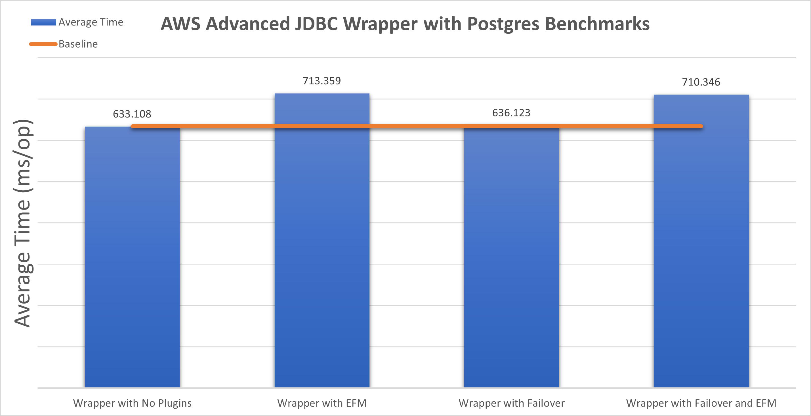
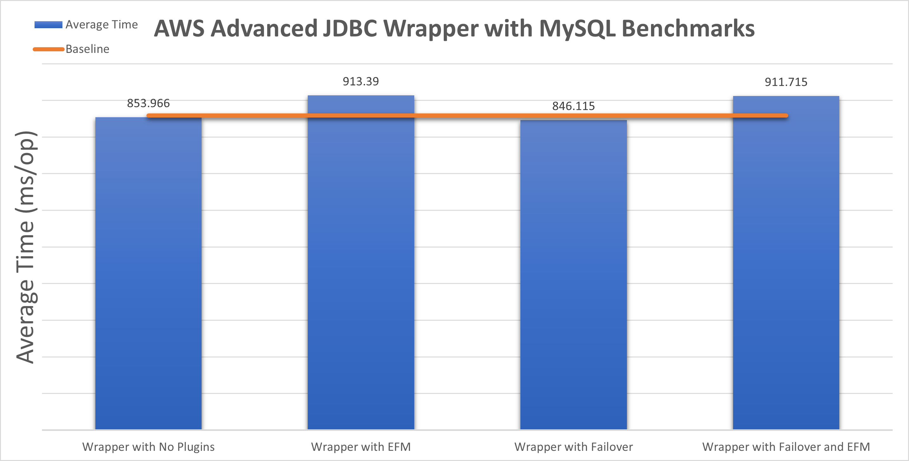
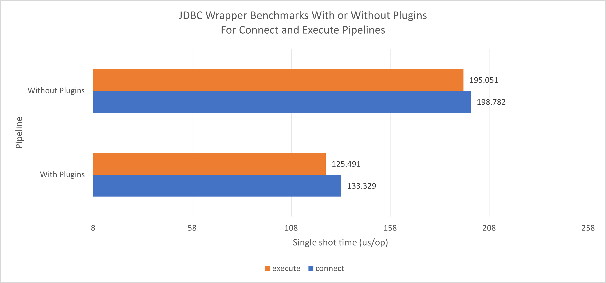
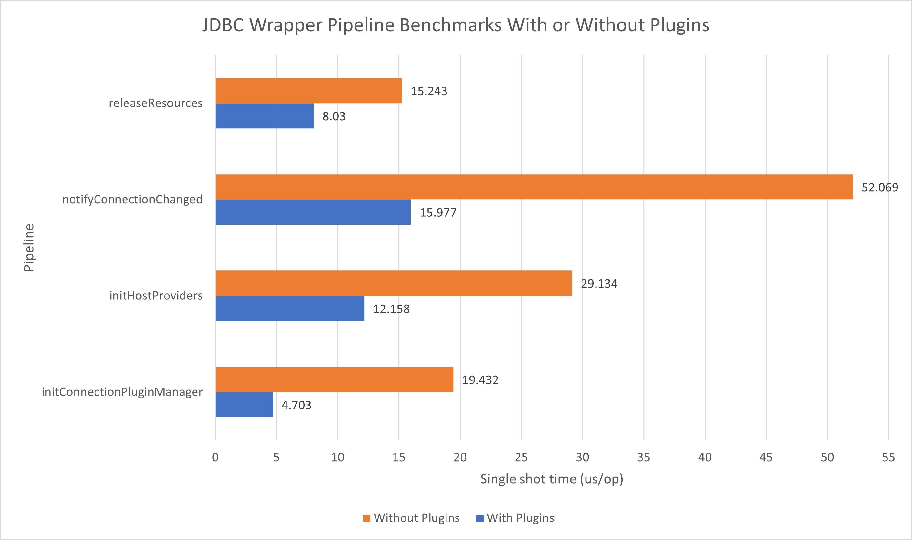
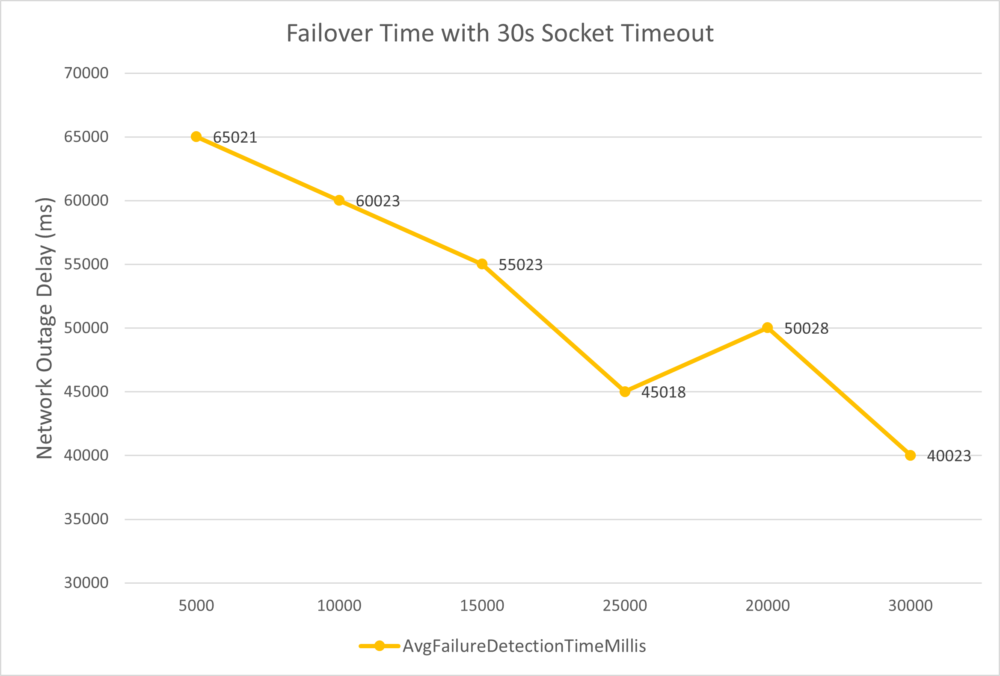
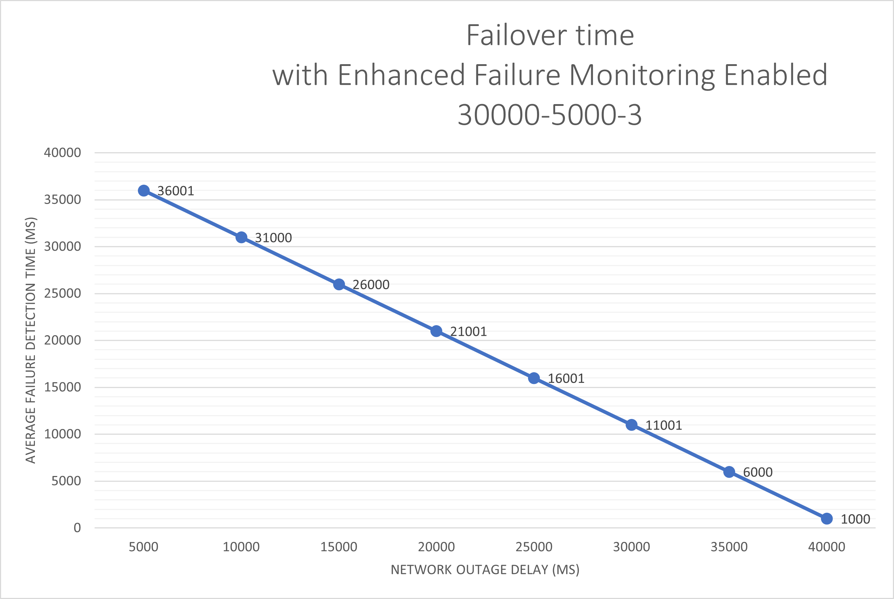
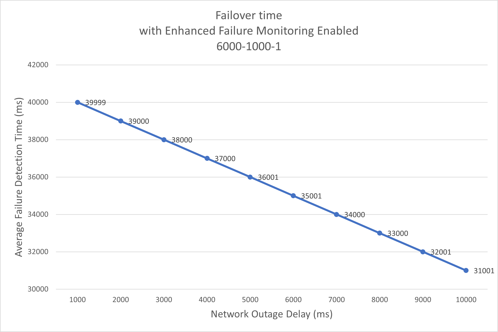
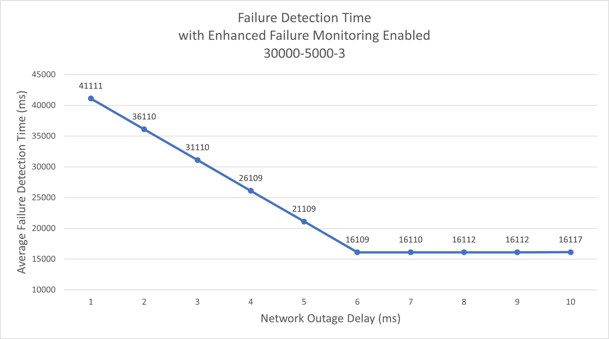
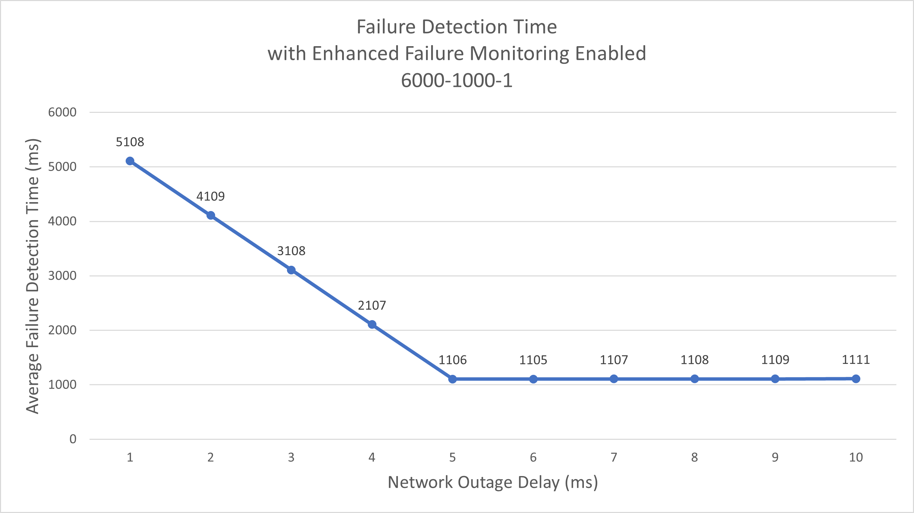
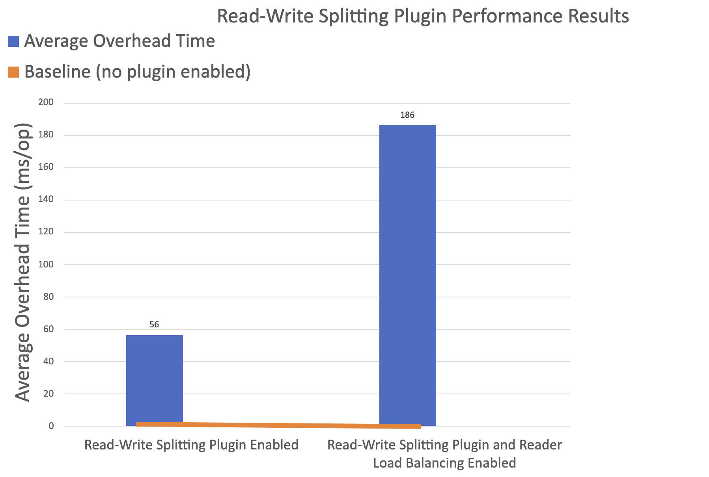

# Development Guide

### Setup
Make sure you have Amazon Corretto 8+ or Java 8+ installed.

Clone the AWS JDBC Driver repository:

```bash
git clone https://github.com/awslabs/aws-advanced-jdbc-wrapper.git
```

You can now make changes in the repository.

### Building the AWS Advanced JDBC Driver
Navigate to project root:
```bash
cd aws-advanced-jdbc-wrapper
```
To build the AWS Advanced JDBC Driver without running the tests:
Mac:

```bash
./gradlew build -x test
```

Windows:
```bash
gradlew build -x test
```

Mac:
```bash
./gradlew build
```

Windows:
```bash
gradlew build
```

## Testing Overview

The AWS JDBC Driver uses the following tests to verify its correctness and performance on both JVM and GraalVM:

| Tests                                         | Description                                                  |
| --------------------------------------------- | ------------------------------------------------------------ |
| Unit tests                                    | Tests for AWS JDBC Driver correctness.                       |
| Failover integration tests                    | Driver-specific tests for different reader and writer failover workflows using the Failover Connection Plugin. |
| Enhanced failure monitoring integration tests | Driver-specific tests for the enhanced failure monitoring functionality using the Host Monitoring Connection Plugin. |
| AWS authentication integration tests          | Driver-specific tests for AWS authentication methods with the AWS Secrets Manager Plugin or the AWS IAM Authentication Plugin. |
| Connection plugin manager benchmarks          | The [benchmarks](../../benchmarks/README.md) subproject measures the overhead from executing JDBC method calls with multiple connection plugins enabled. |

### Extra Integration Tests

The AWS JDBC Driver repository also contains additional integration tests for external tools such as HikariCP, the Spring framework or Hibernate ORM.

The AWS JDBC Driver has been manually verified to work with database tools such as DBeaver.

### Performance Tests

The JDBC Wrapper has 2 types of performance tests:
- benchmarks measuring the AWS JDBC Driver's overhead when executing simple JDBC methods using the JMH microbenchmark framework
- manually-triggered performance tests measuring the failover and enhanced failure monitoring plugins' performance under different configurations

#### AWS JDBC Driver Benchmarks
This diagram shows the benchmarks from running UPDATE queries using the AWS JDBC Driver with pgJDBC as the target driver.
The baseline number represents running the same UPDATE queries with pgJDBC.


This diagram shows the benchmarks from running UPDATE queries using the AWS JDBC Driver with MySQL Connector/J as the target driver.
The baseline number represents running the same UPDATE queries with MySQL Connector/J.


There are also specific benchmarks measuring the AWS JDBC Driver's [pipelines](Pipelines.md).
These benchmarks do not make actual connections to the databases and use simple test plugins.
The goal of these benchmarks is to measure the overhead of using the AWS JDBC Driver with multiple plugins enabled.



See [here](EFMAndFailoverPluginPerformanceResults.md#benchmarks) for a more detailed performance breakdown.

#### Failover-specific Performance Tests
The diagrams in this section show the AWS JDBC Driver's failure detection performance with or without the Failover Connection Plugin under different settings.
The performance tests share the following workflow:

1. The AWS JDBC Driver executes an SQL query with a long execution time.
2. After a network outage delay in milliseconds, the test triggers a network outage.
Varying values for the network outage delay are tested, represented on the X axis of the diagrams below.
3. Measures elapsed time between when the network outage and 
   - when the AWS JDBC Driver detects the network failure if the Host Monitoring Connection Plugin is used, or 
   - when the AWS JDBC Driver finishes the failover process if the Failover Connection Plugin is used.

This diagram shows the failover time with a 30-seconds socket timeout and different network outage delays.

See [here](EFMAndFailoverPluginPerformanceResults.md#failover-performance-with-30-seconds-socket-timeout-configuration) for a more detailed performance breakdown.

The following diagrams show how the AWS JDBC Driver performs under a more common failure detection setting versus a more aggressive setting.

Common Failure Detection Setting

| Parameter                  | Value    |
|----------------------------|----------|
| `failoverTimeoutMs`        | `120000` |
| `failureDetectionTime`     | `30000`  |
| `failureDetectionInterval` | `5000`   |
| `failureDetectionCount`    | `3`      |

Aggressive Failure Detection Setting

| Parameter                  | Value    |
|----------------------------|----------|
| `failoverTimeoutMs`        | `120000` |
| `failureDetectionTime`     | `6000`   |
| `failureDetectionInterval` | `1000`   |
| `failureDetectionCount`    | `1`      |

For more details on failure detection settings, see [here](../using-the-jdbc-driver/using-plugins/UsingTheHostMonitoringPlugin.md#enhanced-failure-monitoring-parameters).
For more details on failover settings, see [here](../using-the-jdbc-driver/FailoverConfigurationGuide.md).


See [here](EFMAndFailoverPluginPerformanceResults.md#failover-performance-with-different-enhanced-failure-monitoring-configuration) for a more detailed performance breakdown.



See [here](EFMAndFailoverPluginPerformanceResults.md#enhanced-failure-monitoring-performance-with-different-failure-detection-configuration) for a more detailed performance breakdown.

#### Read-Write Splitting and Reader Load Balancing Performance Tests

The diagram in this section shows the AWS JDBC Driver's performance when using the read-write splitting plugin, with or without reader load balancing. This test sets up a large number of connections in parallel; the initial connection is to the writer but will be changed to various reader instances if the plugin is enabled. The test executes a long query many times to simulate heavy queries.

The average overhead time is measured as the average time difference between running the entire test with the read-write plugin and running the entire test without any plugins. The baseline overhead time is 0 because there are no plugins in this scenario and thus there is no plugin overhead.

Note that the given overhead values represent the total overhead of running the entire test rather than the overhead of executing a single method. The test executes 1 writer query and 10 read-only queries from 10 connections simultaneously.

See [here](ReadWriteSplittingPluginPerformanceResults.md#read-write-splitting-plugin-postgres-performance-results) for a more detailed performance breakdown.

### Running the Tests

After building the AWS JDBC Driver you can now run the unit tests.
This will also validate your environment is set up correctly.

Mac:
```bash
./gradlew test
```

Windows:
```bash
./gradlew test
```

For more information about running driver-specific integration tests, visit: <br />

[PostgreSQL](/docs/driver-specific/postgresql/postgresql.md)

[MySQL](/docs/driver-specific/mysql/mysql.md)

###### Sample Code
[Connection Test Sample Code](/docs/driver-specific/postgresql/ConnectionSample.java)

## Architecture
For more information on how the AWS Advanced JDBC Driver functions and how it is structured, please visit [Architecture](./Architecture.md).
