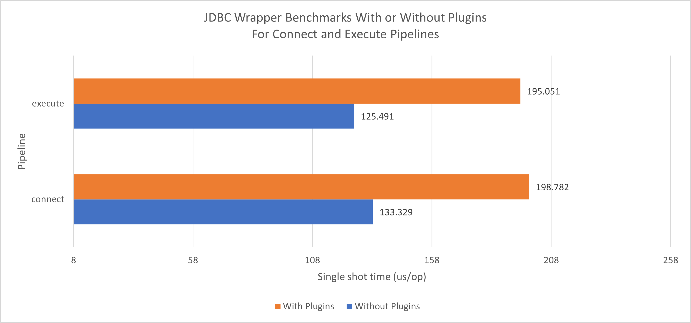
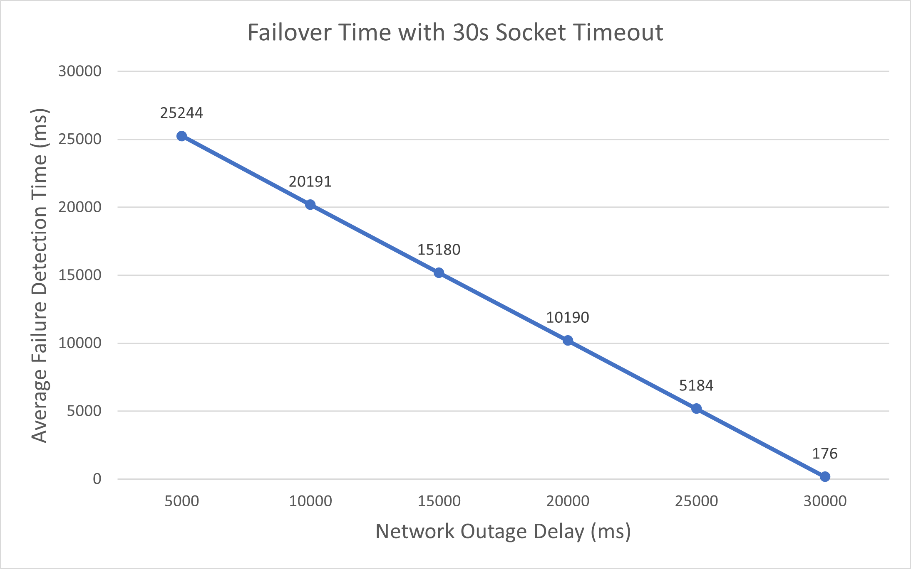
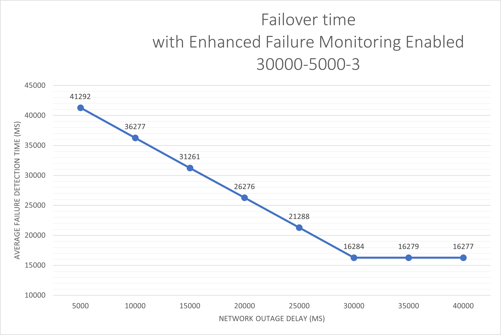
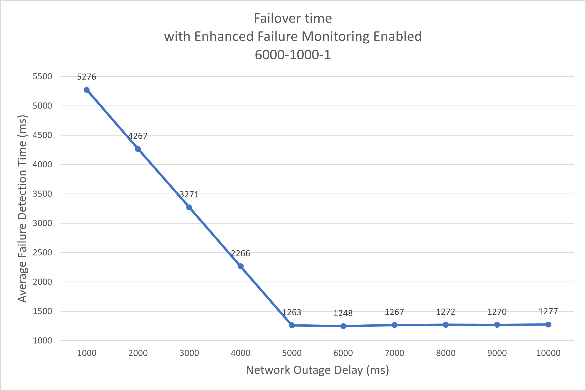
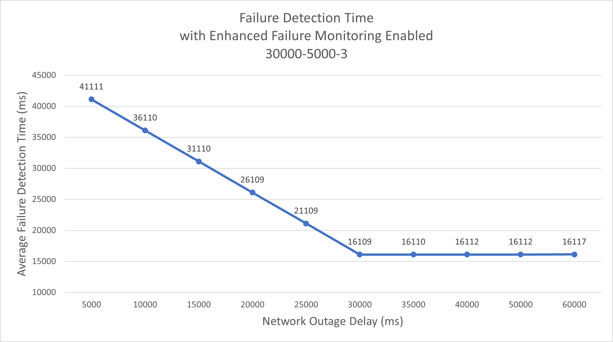
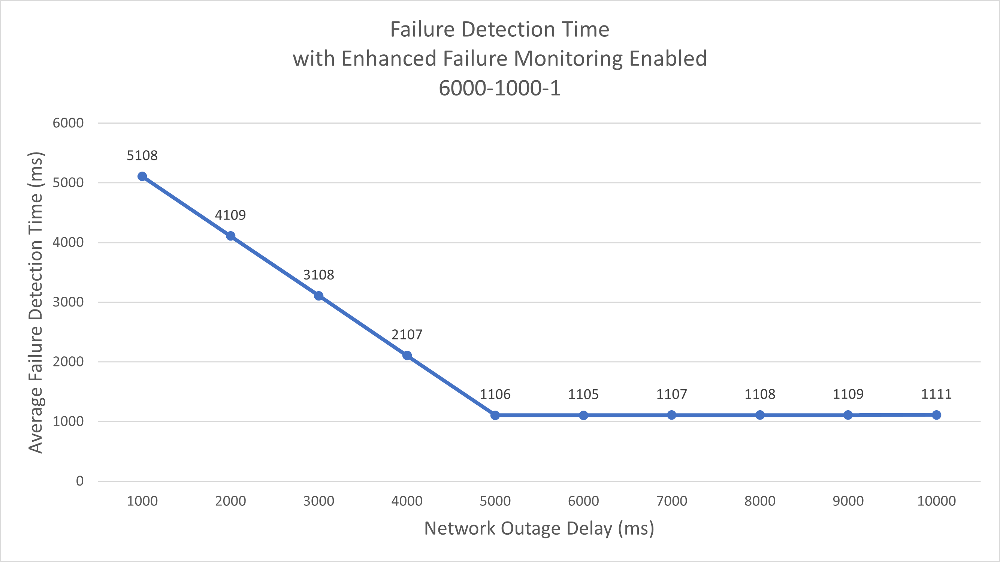

# Development Guide

### Setup
Make sure you have Amazon Corretto 8+ or Java 8+ installed.

Clone the JDBC Wrapper repository:

```bash
git clone https://github.com/awslabs/aws-advanced-jdbc-wrapper.git
```

You can now make changes in the repository.

### Building the AWS Advanced JDBC Wrapper
Navigate to project root:
```bash
cd aws-advanced-jdbc-wrapper
```
To build the AWS Advanced JDBC Wrapper without running the tests:
Mac:
```bash
./gradlew build -x test
```

Windows:
```bash
gradlew build -x test
```

Mac:
```bash
./gradlew build
```

Windows:
```bash
gradlew build
```

## Testing Overview

The JDBC Wrapper uses the following tests to verify its correctness and performance on both JVM and GraalVM:

| Tests                                         | Description                                                                                                                                              |
|-----------------------------------------------|----------------------------------------------------------------------------------------------------------------------------------------------------------|
| Unit tests                                    | Tests for JDBC Wrapper correctness.                                                                                                                      |
| Failover integration tests                    | Driver-specific tests for different reader and writer failover workflows using the Failover Connection Plugin.                                           |
| Enhanced failure monitoring integration tests | Driver-specific tests for the enhanced failure monitoring functionality using the Host Monitoring Connection Plugin.                                     |
| AWS authentication integration tests          | Driver-specific tests for AWS authentication methods with the AWS Secrets Manager Plugin or the AWS IAM Authentication Plugin.                           |
| Connection plugin manager benchmarks          | The [benchmarks](../../benchmarks/README.md) subproject measures the overhead from executing JDBC method calls with multiple connection plugins enabled. |

### Extra Integration Tests

The JDBC Wrapper repository also contains additional integration tests for external tools such as HikariCP, the Spring framework or Hibernate ORM.

The JDBC Wrapper has been manually verified to work with database tools such as DBeaver.

### Performance Tests

The JDBC Wrapper has 2 types of performance tests:
- benchmarks measuring JDBC Wrapper's overhead when executing simple JDBC methods using the JMH microbenchmark framework
- manually-triggered performance tests measuring the failover and enhanced failure monitoring plugins' performance under different configurations

#### JDBC Wrapper Benchmarks
This diagram shows the benchmarks of running some UPDATE queries using the JDBC Wrapper with pgJDBC as the target driver.
The baseline number represents running the same UPDATE queries with pgJDBC.


This diagram shows the benchmarks of running some UPDATE queries using the JDBC Wrapper with MySQL Connector/J as the target driver.
The baseline number represents running the same UPDATE queries with MySQL Connector/J.


There are also specific benchmarks measuring the JDBC Wrapper's [pipelines](Pipelines.md).
These benchmarks do not make actual connections to the databases and use simple test plugins.
The goal of these benchmarks is to measure the overhead of using the JDBC Wrapper with multiple plugins enabled.



See [here](PerformanceResults.md#benchmarks) for a more detailed performance breakdown.

#### Failover-specific Performance Tests
The diagrams in this section show the JDBC Wrapper's failure detection performance with or without the Failover Connection Plugin under different settings.
The performance tests share the following workflow:
1. The JDBC Wrapper executes an SQL query with a long execution time.
2. After a network outage delay in milliseconds, the test triggers a network outage.
Varying values for the network outage delay are tested, represented on the X axis of the diagrams below.
3. Measures elapsed time between when the network outage and 
   - when the JDBC Wrapper detects the network failure if the Host Monitoring Connection Plugin is used, or 
   - when the JDBC Wrapper finishes the failover process if the Failover Connection Plugin is used.

This diagram shows the failover time with a 30-seconds socket timeout and different network outage delays.

See [here](PerformanceResults.md#failover-performance-with-30-seconds-socket-timeout-configuration) for a more detailed performance breakdown.

The following diagrams show how the JDBC Wrapper performs under a more common failure detection setting versus a more aggressive setting.

Common Failure Detection Setting

| Parameter                  | Value    |
|----------------------------|----------|
| `failoverTimeoutMs`        | `120000` |
| `failureDetectionTime`     | `30000`  |
| `failureDetectionInterval` | `5000`   |
| `failureDetectionCount`    | `3`      |

Aggressive Failure Detection Setting

| Parameter                  | Value    |
|----------------------------|----------|
| `failoverTimeoutMs`        | `120000` |
| `failureDetectionTime`     | `6000`   |
| `failureDetectionInterval` | `1000`   |
| `failureDetectionCount`    | `1`      |

For more details on failure detection settings, see [here](../using-the-jdbc-wrapper/using-plugins/UsingTheHostMonitoringPlugin.md#enhanced-failure-monitoring-parameters).
For more details on failover settings, see [here](../using-the-jdbc-wrapper/FailoverConfigurationGuide.md).


See [here](PerformanceResults.md#failover-performance-with-different-enhanced-failure-monitoring-configuration) for a more detailed performance breakdown.



See [here](PerformanceResults.md#enhanced-failure-monitoring-performance-with-different-failure-detection-configuration) for a more detailed performance breakdown.

### Running the Tests

After building the JDBC Wrapper you can now run the unit tests.
This will also validate your environment is set up correctly.

Mac:
```bash
./gradlew test
```

Windows:
```bash
./gradlew test
```

For more information about running driver-specific integration tests, visit: <br />

[PostgreSQL](/docs/driver-specific/postgresql/postgresql.md)

[MySQL](/docs/driver-specific/mysql/mysql.md)

###### Sample Code
[Connection Test Sample Code](/docs/driver-specific/postgresql/ConnectionSample.java)

## Architecture
For more information on how the AWS Advanced JDBC Wrapper functions and how it is structured, please visit [Architecture](./Architecture.md).
