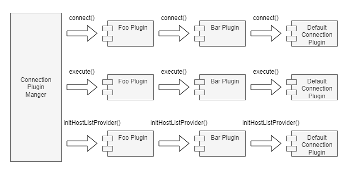

# Pipelines

A plugin pipeline is an execution workflow achieving a specific goal.

The plugin pipelines available in the driver are:
- The connect pipeline.
- The forceConnect pipeline
- The execute pipeline.
- The host list provider pipeline.
- The connection changed notification pipeline.
- The node list changed notification pipeline.
- The accepts strategy pipeline.
- The getHostSpecByStrategy pipeline.

A plugin does not need to implement all pipelines. A plugin can implement one or more pipelines depending on its functionality.

For information on how to subscribe to these pipelines, please see the documentation on [subscribed methods](./LoadablePlugins.md#subscribed-methods).

## Connect Pipeline

The connect pipeline performs any additional setup or post connection steps required to establish a JDBC connection. By default, the connect pipeline will establish connections using the `DriverConnectionProvider` class for Connections requested through the `DriverManager` and `DataSourceConnectionProvider` class for Connections requested through an `AwsWrapperDataSource`. If you would like to use a non-default `ConnectionProvider` to create connections, you can do so by calling `ConnectionProviderManager.setConnectionProvider(ConnectionProvider)`.

The most common usage of the connect pipeline is to fetch extra credentials from external locations.

An example would be the IAM connection plugin. The IAM connection plugin generates an IAM authentication token to be used when establishing a connection. Since authentication is only required when establishing a JDBC connection and not required for any subsequent execution, the IAM authentication plugin only needs to implement the connect pipeline.

## Force Connect Pipeline

The force connect pipeline is similar to the connect pipeline except that it will use the default `DriverConnectionProvider` or `DataSourceConnectionProvider` classes to establish connections regardless of whether a non-default `ConnectionProvider` has been requested via `ConnectionProviderManager.setConnectionProvider(ConnectionProvider)`. For most plugins, the connect and force connect implementation will be equivalent.

## Execute Pipeline

The execute pipeline performs additional work for JDBC method calls. This pipeline is not limited to query execution methods, it may be called for any JDBC methods such as `setTimeout` or `isValid`.

Usages for this pipeline include:

- handling execution exceptions
- logging and measuring execution information
- caching execution results

An example of the execute pipeline is the [execution time connection plugin](/wrapper/src/main/java/software/amazon/jdbc/plugin/ExecutionTimeConnectionPlugin.java).
This plugin measures and logs the time required to execute a JDBC method.

A more complex example of this would be the [failover connection plugin](/wrapper/src/main/java/software/amazon/jdbc/plugin/failover/FailoverConnectionPlugin.java).
The failover connection plugin performs two main tasks before and after the JDBC method call:

- updates the host lists before executing the JDBC method
- catches network exceptions and performs the failover procedure

## Host List Provider Pipeline

The host list provider pipeline sets up the [host list provider](./PluginService.md#host-list-providers) via the plugin service.
This pipeline is executed once during the initialization stage of the connection.

All subscribed plugins are called to set up their respective host list provider.
Since each connection may only have one host list provider,
setting a host list provider would override any previously set host list providers.

The host list providers are used to retrieve host information about the database server,
either from the connection string or by querying the database server.
For simple use cases where having up-to-date information on all existing database replicas is not necessary,
using a simple host list provider such as the [connection string host list provider](/wrapper/src/main/java/software/amazon/jdbc/hostlistprovider/ConnectionStringHostListProvider.java) would be necessary.
The connection string host list provider simply parses the host and port information from the connection string during initialization,
it does not perform any additional work.

For cases where keeping updated information on existing and available replicas is necessary,
such as during the failover procedure, it is important to have a host list provider that can re-fetch information once in a while,
like the [Aurora host list provider](/wrapper/src/main/java/software/amazon/jdbc/plugin/AuroraHostListConnectionPlugin.java).

## Connection Changed Notification Pipeline

Plugins can subscribe to this pipeline to perform special handling when the current connection has changed. Once 
subscribed, plugins should override the `notifyConnectionChanged` method to implement any desired logic. This method 
will be called whenever the current connection changes. Plugins can also provide suggestions of what to do with the old 
connection by returning a 
[suggested action](/wrapper/src/main/java/software/amazon/jdbc/OldConnectionSuggestedAction.java).

## Node List Changed Notification Pipeline

Plugins can subscribe to this pipeline to perform special handling when the current node list of databases has changed. 
Once subscribed, plugins should override the `notifyNodeListChanged` method to implement any desired logic. This method
will be called whenever changes in the current node list are detected.

## Accepts Strategy Pipeline

Plugins should subscribe to this pipeline and the getHostSpecByStrategy pipeline if they implement a host selection strategy via the `getHostSpecByStrategy` method. In this case, plugins should override the `acceptsStrategy` and `getHostSpecByStrategy` methods to implement any desired logic. The `acceptsStrategy` method should return true for each selection strategy that the plugin supports.

## getHostSpecByStrategy pipeline

Plugins should subscribe to this pipeline and the acceptsStrategy pipeline if they implement a host selection strategy. In this case, plugins should override both the `acceptsStrategy` method and the `getHostSpecByStrategy` method. The `acceptsStrategy` method should return true for each strategy that can be processed by the plugin in `getHostSpecByStrategy`. The `getHostSpecByStrategy` method should implement the desired logic for selecting a host using any plugin-accepted strategies. Host selection via a "random" strategy is supported by default.

