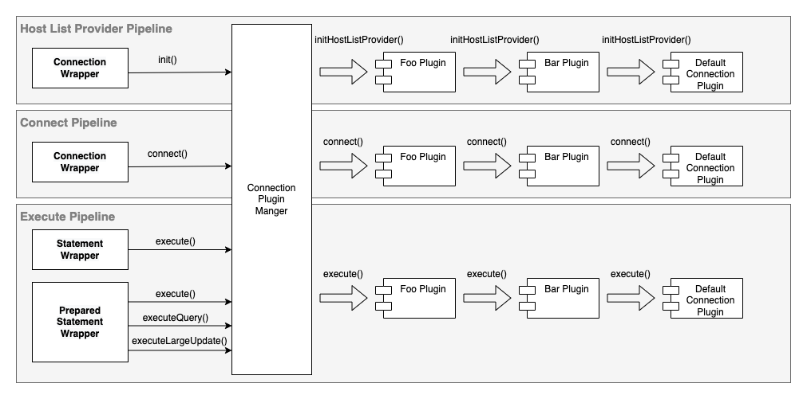

# Connection Plugin Manager

The connection plugin manager has the following main functionalities:

- Load and initialize plugins
- Initiate [pipelines](./Pipelines.md)

## Load and Initialize Plugins

The connection plugin manager initializes all plugins registered via either the `wrapperPlugins` or the `wrapperProfileNames` configuration parameters.

## Initiate Pipelines

During the initial connection phase, where the connection plugin manager gets initialized, it initiates the host list provider and the connect pipeline. These two pipelines will set up a host list provider to be used by all the plugins and the initial connection.

All subsequent JDBC methods calls will trigger the execute pipeline.

> **NOTE:** The execute pipeline does not limit to `execute` methods such as `executeQuery()` or `executeUpdate()` or `Statement` wrappers. All methods, such as `ConnectionWrapper.createStatemet()` can trigger the execute pipeline. In other words, the execute pipeline is to execute all kinds of JDBC methods.
