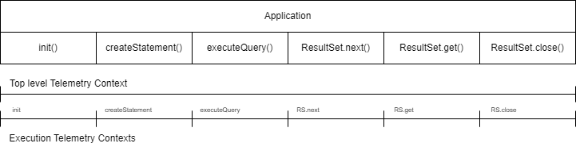
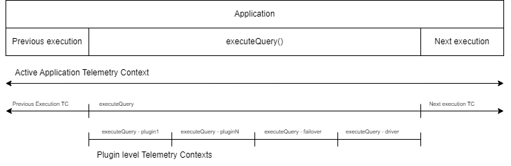

# Adding observability in the JDBC wrapper via metrics

# Introduction

AWS Aurora are databases provided by AWS that are hosted in the AWS cloud. Currently available in Aurora are instances of MySQL and PostgreSQL databases. In order to enable the access from an application to an Aurora database, users need to set up a driver that has the ability to connect and interact with an Aurora database instance set up remotely. Existing drivers for MySQL and PostgreSQL work fine with Aurora instances, but do not take advantage of any of the additional features provided by the Aurora databases.

Recently, AWS has created the AWS JDBC Wrapper driver. The AWS JDBC Wrapper is a driver application that is not a driver in itself, but more of a driver enhancer - an application that set up alongside a database driver, enables some Aurora-specific features to the database driver. Examples of those features are the ability of driver failover (link to doc) and integration with IAM and AWS Secrets Manager (link). The structure of the AWS JDBC Wrapper is organized in plugins, where each new wrapper feature is isolated and independent from other features. That allows users to select which wrapper features/plugins they require in their application workflow.

# Problem

Through the driver, applications interact with a remote database by sending requests. Those requests trigger a chain of execution where every one of the plugins enabled by the user is activated and executed, until the request reaches the database and returns.

In its current form, the AWS JDBC Wrapper is much like a black box: during the chain of execution, there is actually no possibility to measure the individual performance of each plugin throughout the execution of a query. Which means that in the event of loss of performance while using the Wrapper, the troubleshooting process is manual, requiring users to dive deep inside application logs and manually inspecting the behavior of each plugin enabled.

This project aims to add internal observability of the Wrapper performance at plugin level.

# Goals

The goals of the project are the following:

- Instrument the wrapper code in order to obtain metrics and traces at plugin level
- Define observability interfaces that make the code agnostic to a specific observability library or tool
- Add plugin-specific metrics to existing plugins
- Implement connectors/exporters to visualize the generated observability data

# Proposed solution

## Definitions

As previously mentioned in the Goals section, one important thing we aim is while adding observability to the driver, to not attach our codebase to any vendor specific or specific existing metrics library.

This is not only to avoid adding a new external dependency to the wrapper, but mostly due to the fact that very often, applications that use the wrapper to interact with a database already have their own observability and/or monitoring implementations.

When that is the case, we would like ideally to have wrapper specific metrics simply added to the already existing users application monitoring. In order to achieve that, we needed to find some standard observability method that would fit most users workflow. For this project, we have decided to follow OpenTelemetry (link) notations and definitions for our monitoring entities.

OpenTelemetry aims to define vendor and language agnostic specs on how to monitor applications.

The entities we introduce in this project are the following: Metrics and Traces.

### Traces

We define a trace as a defined sequence of an application execution, specifically defined by its start and its end. A trace can contain the entire application execution, or a single atomic operation. Traces can be related either by hierarchy either with symbolic links.

Collecting libraries will see the traces boundaries and measure the execution time for a particular trace. For a better understanding on the application behavior, different attributes can be attached to a trace, such as a success status and/or status code.

In our project, traces are represented as `TelemetryContext` objects. A `TelemetryContext` object will be created/opened at every plugin invocation or execution.

`TelemetryContext` objects are similar to what OpenTelemetry define as *spans*, and also to the concept of *trace* in AWS X-Ray, the trace visualization mechanism featured in AWS Cloudwatch.

### Metrics

Metrics will also be added to our observability suite for the numeric data that will be collected throughout the application execution.

For metrics, we follow the same standard defined by OpenTelemetry, which consists of:
- Counters
- Gauge
- Histogram

Gauges will be used for situations where the numeric data is varies, but not incrementally throughout the execution of the application. An example of that would be a hit/miss ratio for a cache.

Further information on those 3 entities, and to which kind of data they suit better can be found in the OpenTelemetry documentation (link).

### Warning

It is important to state that despite the fact that the entities and objects that we define here are either similar, or either can be mapped to OpenTelemetry concepts, we are still creating our observability layer independently of any available library or suite. Using the OpenTelemetry libraries for JAVA require writing the mapping (in this case, an interface instantiation) from our definitions to the OpenTelemetry objects.

## Plugin-level tracing

Having defined our objects and entities for tracing, our solution will be first to open a telemetry context for every wrapper execution. In that way, the monitoring will be able to show traces for every different operation executed by the wrapper. Every operation, such as `createStatement()`  and  `executeQuery()` will now be individually traced.

In order to achieve that, a `TelemetryContext` object will be opened inside every call to `executeWithPlugins()` in the `WrapperUtils` class. The object will be created before the execution and closed right after, tracing its execution.

Then, once those traces are created, we will also open a new telemetry context for each plugin execution inside the wrapper execution.

The plugin execution chain is created in the `ConnectionPluginManager` class, where execution lambdas are generated and invoke the `execute()` method for every plugin subscribed to a given execution.

Inside the function that generates that plugin execution chain, we will encapsulate those lambdas with `TelemetryContext` objects that will then trace every plugin execution individually.

The image above displays the different telemetry contexts that are opened inside the plugin execution chain, allowing plugin specific tracing.

## Plugin-specific metrics

In addition to plugin-level tracing, we will also introduce specific metrics related to performance for each available plugin. The list of the available plugins that will have metrics added is the following:

- Data cache plugin
- Failover plugin
- IAM authentication plugin
- AWS Secrets manager plugin
- EFM (Enhanced failure monitoring) plugin

### Data cache plugin

Metrics:
(Metric name | metric type | Unit (if applicable) | Dimensions | Description)

- Execution counter\
  Type: counter\
  Counts the amount of times the plugin has been executed

- Put counter\
  Type: counter\
  Counts the amount of times any object has been put into the cache

- Get counter\
  Type: counter\
  Counts the amount of times any object has been looked up in the cache

- Hit counter\
  Type: counter\
  Counts the amounts of time an object was looked up in the cache and retrieved

- Hit counter per query\
  Type: counter\
  Dimension: query\
  Counts the amounts of time a given query was looked up in the cache and retrieved

- Miss counter\
  Type: counter\
  Counts the amounts of time an object was looked up in the cache and not found

- Miss counter per query\
  Type: counter\
  Dimension: query\
  Counts the amounts of time each query was looked up in the cache and not found

- Hit/Miss ratio\
  Type: percentage\
  In a given frequency, computes the percentage of hits / the amount of lookups

- Hit/Miss ratio\
  Type: gauge\
  Dimension: query\
  In a given frequency, computes the percentage of hits / the amount of lookups for each query

- Cache clear counter\
  Type: counter\
  Counts the amount of times the data cache has been cleared

### Failover plugin

Metrics:
(Metric name | metric type | Unit (if applicable) | Dimensions | Description)

- Execution counter\
  Type: counter\
  Counts the amount of times the plugin has been executed

- Failover trigger counter\
  Type: counter\
  Counts the amount of times failover has been triggered

- Writer failover counter\
  Type: counter\
  Counts the amount of time failover was triggered and the driver has reconnected to a writer instance

- Reader failover counter\
  Type; counter\
  Counts the amount of time failover was triggered and the driver has reconnected to a reader instance

### EFM Plugin

Metrics:
(Metric name | metric type | Unit (if applicable) | Dimensions | Description)

- Execution counter\
  Type: counter\
  Counts the amount of times the plugin has been executed
