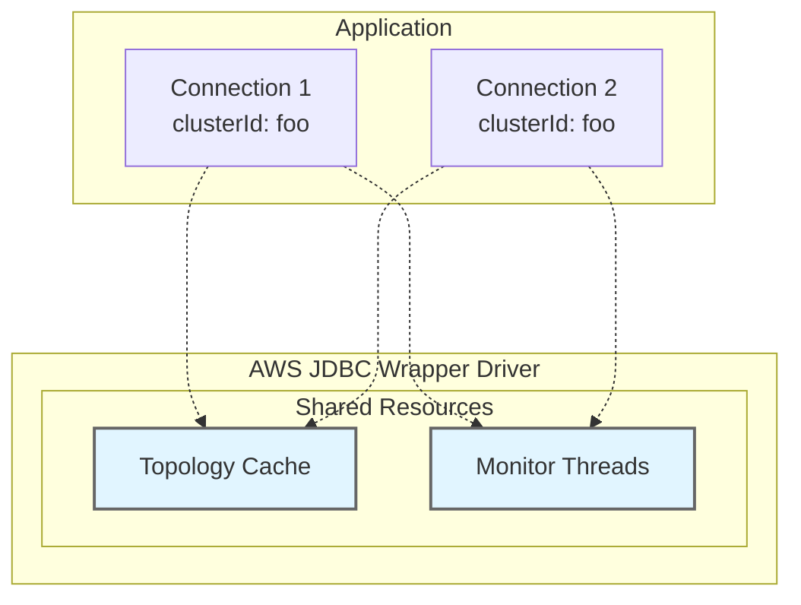
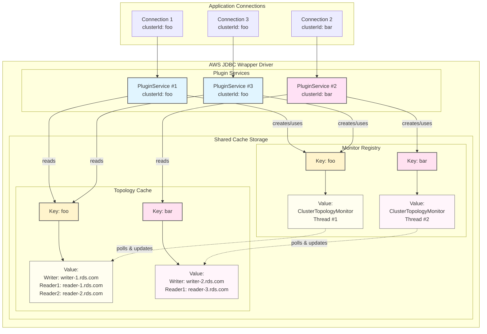
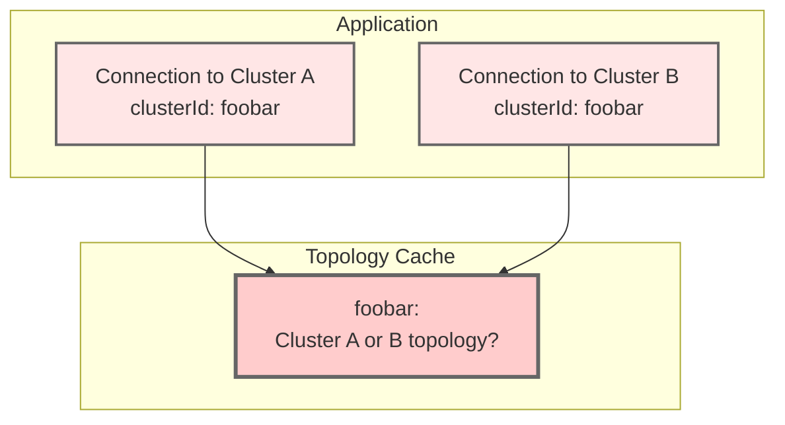
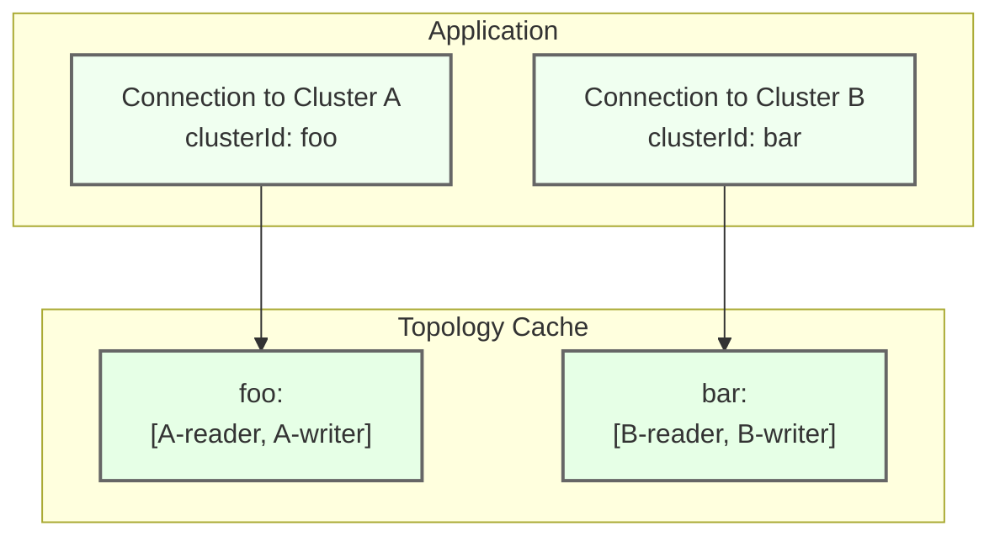

# Understanding the clusterId Parameter

## Overview

The `clusterId` parameter is a critical configuration setting when using the AWS Advanced JDBC Wrapper to connect to multiple database clusters within a single application. This parameter serves as a unique identifier that enables the driver to maintain separate caches and state for each distinct database cluster your application connects to.

## What is a Cluster?

In the context of the AWS Advanced JDBC Wrapper, a **cluster** is a logical grouping of database instances that should share the same topology cache, connection pools, and monitoring services. Understanding what constitutes a cluster is crucial for correctly setting the `clusterId` parameter.

A cluster represents one writer instance (primary), zero or more reader instances (replicas), shared topology that the driver needs to track, and a single failover domain where the driver can switch between instances.

### Examples of Clusters

- Aurora DB Cluster (one writer + multiple readers)
- RDS Multi-AZ DB Cluster (one writer + two readers)
- Aurora Global Database (when supplying a global db endpoint, the driver considers them as a single cluster)


> **Rule of thumb:** If the driver should track separate topology information and perform independent failover operations, use different `clusterId` values. If instances share the same topology and failover domain, use the same `clusterId`.


## Why clusterId is Important

The AWS Advanced JDBC Wrapper uses the `clusterId` as a **key for internal caching mechanisms** to optimize performance and maintain cluster-specific state. Without proper `clusterId` configuration, your application may experience:

- Cache collisions between different clusters
- Incorrect topology information
- Connection pool conflicts
- Degraded performance due to cache invalidation

## Why Not Use AWS DB Cluster Identifiers?

Host information can take many forms:

- **IP Address Connections:** `jdbc:aws-wrapper:mysql://10.0.1.50:3306/mydb` ← No cluster info!
- **Custom Domain Names:** `jdbc:aws-wrapper:mysql://db.mycompany.com:3306/mydb` ← Custom domain
- **Custom Endpoints:** `jdbc:aws-wrapper:mysql://my-custom-endpoint.cluster-custom-abc.us-east-1.rds.amazonaws.com:3306/mydb` ← Custom endpoint
- **Proxy Connections:** `jdbc:aws-wrapper:mysql://my-proxy.proxy-abc.us-east-1.rds.amazonaws.com:3306/mydb` ← Proxy, not actual cluster

In fact, all of these could reference the exact same cluster. Therefore, because the driver cannot reliably parse cluster information from all connection types, **it is up to the user to explicitly provide the `clusterId`**.

## How clusterId is Used Internally

The driver uses `clusterId` as a cache key for topology information and monitoring services. This enables multiple connections to the same cluster to share cached data and avoid redundant db meta-data.

### High-Level View

The following diagram shows how connections with the same `clusterId` share cached resources:



Topology Cache could look something like:
```json
{
  "foo": ["hostA","hostB","hostC"],
  "bar": ["barHost1"]
}
```
> Both Connection 1 and Connection 2 retrieve the **same cached value** using the key `"foo"`, avoiding redundant topology queries to the database.

**Key Points:**
- Multiple connections with the **same `clusterId`** share the same cached topology and monitors
- Shared caches reduce database queries and improve performance
- Background monitors are keyed by `clusterId` to avoid duplicate threads

### Low-Level View

Here's how the driver stores and retrieves data using `clusterId` as the cache key:



**How it works:**
- Each connection creates its own PluginService instance.
- Connection 1 and 3 both use `clusterId: "foo"` → Their separate PluginService instances access the same shared cache entries
- Connection 2 uses `clusterId: "bar"` → Its PluginService accesses separate cache entries
- PluginService reads topology from shared cache using `clusterId` as the key
- Each cache is a Map structure: `Map<String, CacheValue>` where the key is the `clusterId`
- Monitors poll the database and update the topology cache

## When to Specify clusterId

### **Required: Multiple Clusters in One Application**

You **must** specify a unique `clusterId` when your application connects to multiple database clusters:

```java
// Application connecting to two different clusters
Properties prodProps = new Properties();
prodProps.setProperty("clusterId", "production-cluster");
prodProps.setProperty("user", "admin");
prodProps.setProperty("password", "***");
Connection prodConn = DriverManager.getConnection(
    "jdbc:aws-wrapper:mysql://prod-cluster.us-east-1.rds.amazonaws.com:3306/mydb",
    prodProps
);

Properties stagingProps = new Properties();
stagingProps.setProperty("clusterId", "staging-cluster");  // Different clusterId!
stagingProps.setProperty("user", "admin");
stagingProps.setProperty("password", "***");
Connection stagingConn = DriverManager.getConnection(
    "jdbc:aws-wrapper:mysql://staging-cluster.us-east-1.rds.amazonaws.com:3306/mydb",
    stagingProps
);
```

### **Optional: Single Cluster Applications**

If your application only connects to one cluster, you can omit `clusterId` (defaults to `"1"`):

```java
// Single cluster - clusterId defaults to "1"
Connection conn = DriverManager.getConnection(
    "jdbc:aws-wrapper:mysql://my-cluster.us-east-1.rds.amazonaws.com:3306/mydb",
    props
);
```

### **Highly Recommended: Consistent clusterId for Same Cluster**

When making multiple connections to the **same cluster**, you should use the **same `clusterId`** to benefit from shared caching:

```java
// Multiple connections to the same cluster - use same clusterId
String url = "cluster-a..."
Properties props1 = new Properties();
props1.setProperty("clusterId", "my-cluster");
Connection conn1 = DriverManager.getConnection(url, props1);

Properties props2 = new Properties();
props2.setProperty("clusterId", "my-cluster");  // Same clusterId = shared cache
Connection conn2 = DriverManager.getConnection(url, props2);
```

**Benefits of consistent `clusterId`:**
- Shared topology cache (no redundant queries)
- Shared connection pools (better resource utilization)
- Single monitoring thread per cluster (reduced overhead)


## Critical Warnings

### 🚨 **NEVER Share clusterId Between Different Clusters**

Using the same `clusterId` for different database clusters will cause serious issues:

```java
// ❌ WRONG - Same clusterId for different clusters
Properties props1 = new Properties();
props1.setProperty("clusterId", "shared-id");  // ← BAD!
Connection conn1 = DriverManager.getConnection(
    "jdbc:aws-wrapper:mysql://cluster-a.us-east-1.rds.amazonaws.com:3306/db",
    props1
);

Properties props2 = new Properties();
props2.setProperty("clusterId", "shared-id");  // ← BAD! Same ID for different cluster
Connection conn2 = DriverManager.getConnection(
    "jdbc:aws-wrapper:mysql://cluster-b.us-west-2.rds.amazonaws.com:3306/db",
    props2
);
```

**What happens with cache collision:**



**Problems this causes:**
- Topology cache collision (cluster-b's topology could overwrite cluster-a's)
- Incorrect failover behavior (driver may try to failover to wrong cluster)
- Monitor conflicts (Only one monitor instance for both clusters will lead to undefined results)

**Correct approach:**
```java
// ✅ CORRECT - Unique clusterId for each cluster
props1.setProperty("clusterId", "cluster-a-prod");
props2.setProperty("clusterId", "cluster-b-staging");
```

**Correct architecture:**



### ⚠️ **Always Use Same clusterId for Same Cluster**

Using different `clusterId` values for the same cluster reduces efficiency:

```java
// ⚠️ SUBOPTIMAL - Different clusterIds for same cluster
Properties props1 = new Properties();
props1.setProperty("clusterId", "my-cluster-1");
Connection conn1 = DriverManager.getConnection(sameClusterUrl, props1);

Properties props2 = new Properties();
props2.setProperty("clusterId", "my-cluster-2");  // Different ID for same cluster
Connection conn2 = DriverManager.getConnection(sameClusterUrl, props2);
```

**Problems this causes:**
- Duplication of caches
- Multiple monitoring threads for the same cluster

**Best practice:**
```java
// ✅ BEST - Same clusterId for same cluster
final String CLUSTER_ID = "my-production-cluster";
props1.setProperty("clusterId", CLUSTER_ID);
props2.setProperty("clusterId", CLUSTER_ID);  // Shared cache and resources
```

## Summary

The `clusterId` parameter is essential for applications connecting to multiple database clusters. It serves as a cache key for topology information, connection pools, and monitoring services. Always use unique `clusterId` values for different clusters, and consistent values for the same cluster to maximize performance and avoid conflicts.
