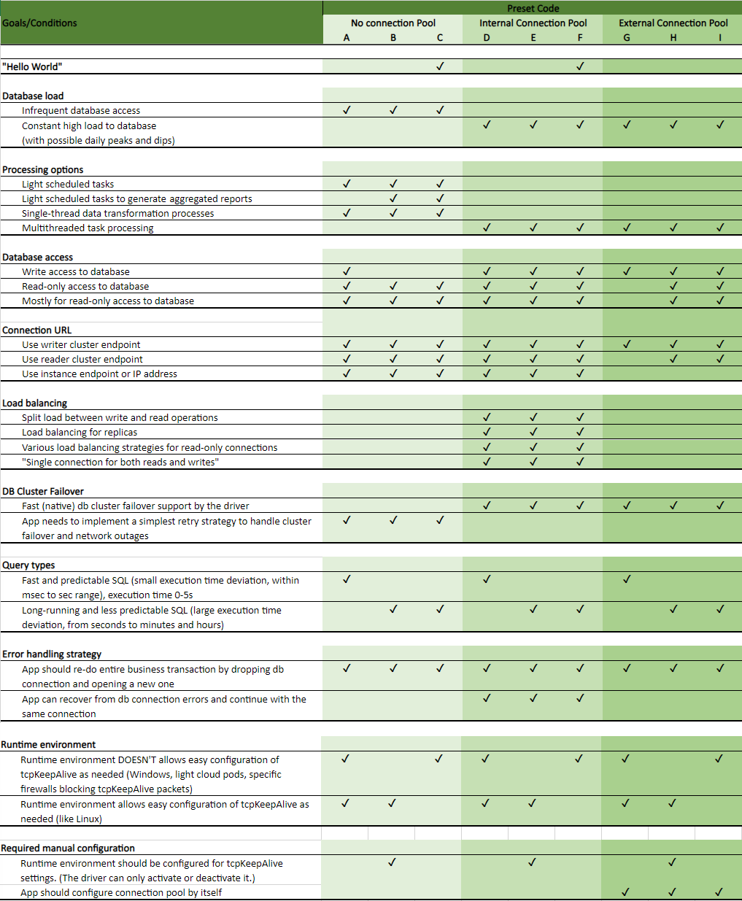

# Configuration Presets

## What is a Configuration Preset?

A Configuration Preset is a [configuration profile](./UsingTheJdbcDriver.md#configuration-profiles) that has already been set up by the AWS JDBC Driver team. Preset configuration profiles are optimized, profiled, verified and can be used right away. If the existing presets do not cover an exact use case, users can also create their own configuration profiles based on the built-in presets.

## Using Configuration Presets

The Configuration Preset name should be specified with the [`wrapperProfileName`](#connection-plugin-manager-parameters) parameter.

```java
properties.setProperty("wrapperProfileName", "A2");
```

Users can create their own custom configuration profiles based on built-in configuration presets. 

Users can not delete built-in configuration presets.

```java
// Create a new configuration profile "myNewProfile" based on "A2" configuration preset
ConfigurationProfileBuilder.from("A2")
    .withName("myNewProfile")
    .withDialect(new CustomDatabaseDialect())
.buildAndSet();

properties.setProperty("wrapperProfileName", "myNewProfile");
```

## Existing Configuration Presets

Configuration Presets are optimized for 3 main user scenarios. They are:
- **No connection pool** preset family: `A`, `B`, `C`
- AWS JDBC Driver **Internal connection pool** preset family: `D`, `E`, `F`
- **External connection pool** preset family: `G`, `H`, `I`

Some preset names may include a number, like `A0`, `A1`, `A2`, `D0`, `D1`, etc. Usually, the number represent sensitivity or timing variations for the same preset. For example, `A0` is optimized for normal network outage sensitivity and normal response time, while `A1` is less sensitive. Please take into account that more aggressive presets tend to cause more false positive failure detections. More details can be found in this file: [ConfigurationProfilePresetCodes.java](./../../wrapper/src/main/java/software/amazon/jdbc/profile/ConfigurationProfilePresetCodes.java) 

Configuration presets starting with the `SF_` prefix are optimized for Spring Framework/Boot applications. These presets correspond to the same presets with no such prefix, but have the [Read/Write Splitting Plugin](./using-plugins/UsingTheReadWriteSplittingPlugin.md) disabled. For instance, the preset `SF_A0` is the Spring Framework optimized version of the `A0` preset. More details are available at [Read/Write Splitting Plugin Example](./using-the-jdbc-driver/using-plugins/UsingTheReadWriteSplittingPlugin.md#example). Since the `SF_` presets are functionally equivalent to their corresponding generic presets, more information on each `SF_` preset can be found in the diagram below in the corresponding generic preset section.

Choosing the right configuration preset for your application can be a challenging task. Many presets could potentially fit the needs of your application. Various user application requirements and goals are presented in the following table and organized to help you identify the most suitable presets for your application.

PDF version of the following table can be found [here](./../files/configuration-profile-presets.pdf).

<div style="text-align:center"></div>
