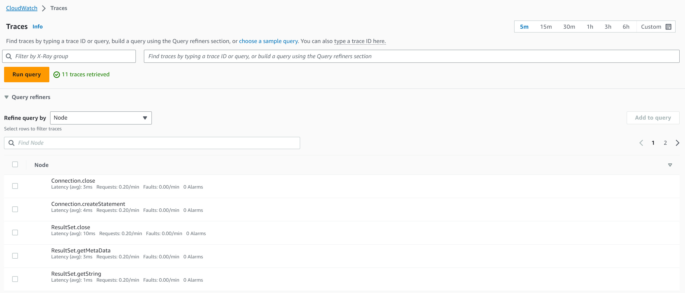
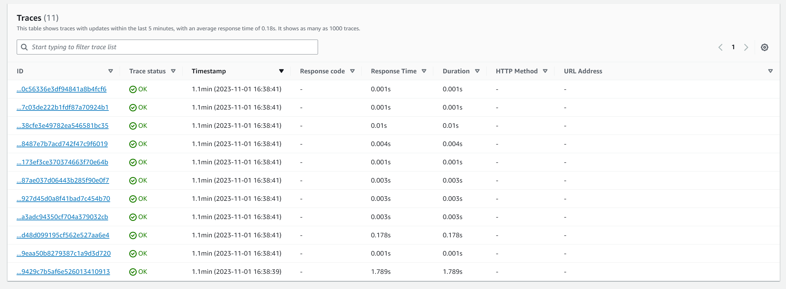
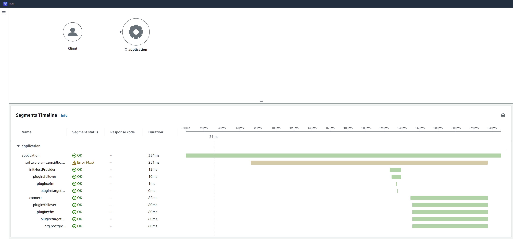

# Monitoring

Monitoring is the ability to gather data and insights on the execution of an application. Users will also be able to inspect the gathered data and determine potential actions to take depending on the data collected.

Version 2.3.0 of the AWS JDBC Driver introduced the Telemetry feature. This feature allows you to collect and visualize data of the AWS JDBC Driver execution at a global level and at plugin level. You can now monitor the performance of the driver as a whole or within specific plugins with your configurations, and determine whether the driver's performance meets your expectations.

## Terminology

The AWS JDBC Driver provides telemetry data through two different forms: **Traces** and **Metrics**.

### Traces

Traces give an overview of what is happening in a specific section of the execution of an application. A trace is composed by a hierarchical sequence of segments, each of which contain basic information about the execution (e.g., duration), and whether that section was executed successfully or not.

In the AWS JDBC Driver, initially a trace will be generated for every JDBC call made to the wrapper. Depending on whether the user application has already a trace open, it might be either nested into the opened trace or dropped. And then, for each enabled plugin, another segment will be created only for the plugin execution, linked to the JDBC call segment.

Traces from the AWS JDBC Driver are submitted to [**AWS X-Ray**](https://aws.amazon.com/xray/).

### Metrics

Metrics are numeric data that were measured and collected through the execution of an application. Those metrics can give an insight on how many times some action (e.g., failover) has happened, and for actions that may happen multiple times, their success or failure rate (failover, cache hits, etc.), amongst other related information.

The AWS JDBC Driver will submit metrics data to [**Amazon Cloudwatch**](https://aws.amazon.com/cloudwatch/).

The list of available metrics for the AWS JDBC Driver and its plugins is available in the [List of Metrics](#List-Of-Metrics) section of this page.

## Setting up the AWS Distro for OpenTelemetry Collector (ADOT Collector)

## Prerequisites

Before enabling the Telemetry feature, a few setup steps are required to ensure the monitoring data gets properly emitted.

1. In order to visualize the telemetry data in the AWS Console, make sure you have an IAM user or role with permissions to [AWS X-Ray](https://docs.aws.amazon.com/xray/latest/devguide/security-iam.html) and [Amazon CloudWatch](https://docs.aws.amazon.com/AmazonCloudWatch/latest/monitoring/auth-and-access-control-cw.html).

2. Download the [AWS Distro for OpenTelemetry Collector](https://aws-otel.github.io/docs/getting-started/collector) and set it up. The AWS Distro for OpenTelemetry Collector is responsible from receiving telemetry data from the application using the AWS JDBC Driver and forward it to AWS. Both of those connections happen via HTTP, therefore URLs and ports need to be correctly configured for the collector.

> [!WARNING]
> The AWS Distro for OpenTelemetry Collector can be set up either locally or remotely. It is up to the user to decide where is best to set it up. If you decide to host it remotely, ensure that the application has the necessary permissions or allowlists to connect to the Collector.

> [!WARNING]
> The collector is an external application that is not part of the wrapper itself. Without a collector, the wrapper will collect monitoring data from its execution but that data will not be sent anywhere for visualization.

## Using Telemetry

Telemetry for the AWS JDBC Driver is a monitoring strategy that overlooks all plugins enabled in [`wrapperPlugins`](./UsingTheJdbcDriver.md#connection-plugin-manager-parameters) and is not a plugin in itself. Therefore no changes are required in the `wrapperPlugins` parameter to enable Telemetry.

In order to enable Telemetry in the AWS JDBC Driver, you need to:

1. Set the `enableTelemetry` property to `true`. You can either set it through Properties or directly in the connection string.

2. Set up the recorders that will export the telemetry data from the code to the ADOT Collector.

Setting up the recorders require to instantiate an `OpenTelemetrySDK` in the application code prior to executing the driver. Instantiating the `OpenTelemetrySDK` requires you to configure the endpoints where traces and metrics are being forwarded to.

The code sample below shows a simple manner to instantiate trace and metrics recording in an application using Telemetry.

```java
OtlpGrpcSpanExporter spanExporter =
    OtlpGrpcSpanExporter.builder().setEndpoint(System.getenv("OTEL_EXPORTER_OTLP_ENDPOINT")).build();
OtlpGrpcMetricExporter metricExporter =
    OtlpGrpcMetricExporter.builder().setEndpoint(System.getenv("OTEL_EXPORTER_OTLP_ENDPOINT")).build();

SdkTracerProvider tracerProvider =
    SdkTracerProvider.builder().addSpanProcessor(SimpleSpanProcessor.create(spanExporter)).build();
SdkMeterProvider meterProvider = SdkMeterProvider.builder()
    .registerMetricReader(PeriodicMetricReader.builder(metricExporter).setInterval(15, TimeUnit.SECONDS).build())
    .build();

OpenTelemetrySdk.builder()
    .setTracerProvider(tracerProvider)
    .setMeterProvider(meterProvider)
    .setPropagators(ContextPropagators.create(W3CTraceContextPropagator.getInstance()))
    .buildAndRegisterGlobal();
```

We also provide a [complete sample application](../../examples/AWSDriverExample/src/main/java/software/amazon/TelemetryMetricsOTLPExample.java) using telemetry in the examples folder of this repository.

### Telemetry Parameters
In addition to the parameter that enables Telemetry, you can pass following parameters to the AWS JDBC Driver through the connection URL to configure how telemetry data will be forwarded.

| Parameter                 |  Value  | Required | Description                                                                                                                                                                                                                                                                                                                                                                                                                                                                                                                                                                                                                   | Default Value |
|---------------------------|:-------:|:--------:|:------------------------------------------------------------------------------------------------------------------------------------------------------------------------------------------------------------------------------------------------------------------------------------------------------------------------------------------------------------------------------------------------------------------------------------------------------------------------------------------------------------------------------------------------------------------------------------------------------------------------------|---------------|
| `enableTelemetry`         | Boolean |    No    | Telemetry will be enabled when this property is set to `true`, otherwise no telemetry data will be gathered during the execution of the wrapper.                                                                                                                                                                                                                                                                                                                                                                                                                                                                              | `false`       |
| `telemetryTracesBackend`  | String  |    No    | Determines to which backend the gathered tracing data will be forwarded to. Possible values include: `NONE`, `XRAY`, and `OTLP`.<br>`NONE` indicates that the application will collect tracing data but this data will not be forwarded anywhere.<br>`XRAY` indicates that the traces will be collected by the AWS XRay Daemon.<br>`OTLP` indicates that the traces will be collected by the AWS OTEL COllector.                                                                                                                                                                                                              | `NONE`        |
| `telemetryMetricsBackend` | String  |    No    | Determines to which backend the gathered metrics data will be forwarded to. Possible values include: `NONE` and `OTLP`.<br>`NONE` indicates that the application will collect metrics data but this data will not be forwarded anywhere.<br>`OTLP` indicates that the metrics will be collected by the AWS OTEL COllector.                                                                                                                                                                                                                                                                                                    | `NONE`        |
| `telemetrySubmitTopLevel` | Boolean |    No    | By default the driver will look for open traces in the users application prior to record telemetry data. If there is a current open trace, the traces created will be attached to that open trace. If not, all telemetry traces created will be top level. Setting the parameter to `false` means that every JDBC call to the driver will generate a trace with no direct parent trace attached to it. If there is already an open trace being recorded by the application, no driver traces will be created. See the [Nested tracing strategies section](#nested-tracing-strategies-using-amazon-xray) for more information. | `false`       |

## Nested tracing strategies using Amazon XRay

As you could see in the [Telemetry Parameters](#Telemetry-Parameters) section, the AWS JDBC Driver allows an user to determine which strategy for nested traces to use when using Telemetry.

Traces are hierarchical entities and it might be that the user application already has an open trace in a given sequence of code that connects to the AWS JDBC Driver. In this case, the Telemetry feature allows users to determine which strategy to use for the Telemetry traces generated when using the driver.

A top level trace is a trace that has no link to any other parent trace, and is directly accessible from the list of submitted traces within XRay. In the following pictures, the top level traces of an application are displayed in AWS X-Ray.

<div style="text-align:center"></div>

<div style="text-align:center"></div>

When a trace is hierarchically linked to a parent trace, we say that this trace is nested. An example of nested traces are the individual plugin traces for a given JDBC call. All the individual plugin traces are linked to a parent trace for the JDBC call. Those nested traces are illustrated in the image below.

<div style="text-align:center"></div>

Applications that interact with the AWS JDBC Driver may or may not have already opened telemetry traces on their own. In this case, it is up to the user to determine how they want to mix both application and driver traces.

This can be done using the AWS JDBC Driver's `telemetrySubmitTopLevel` property. This property allows users to choose to submit the driver traces always as top level traces or to submit them nested to the application traces.
The default value is set to `false`, which means the driver traces to always be nested into their application traces. That will happen unless there are no open application traces when the driver is running. In that case no driver traces will be collected or submitted. When the property is set to `true`, all the driver traces would be submitted top level traces. If the application has already open traces, it will not be possible for the driver traces to be top level and the driver traces therefore will not be submitted.

## List of Metrics

The AWS JDBC Driver also submits a set of metrics to Amazon Cloudwatch when the driver is used. These metrics are predefined and they help give insight on what is happening inside the plugins when the plugins are used.

Metrics can be one of 3 types: counters, gauges or histograms.

### EFM plugin

| Metric name                    | Metric type | Description                                                                                           |
|--------------------------------|-------------|-------------------------------------------------------------------------------------------------------|
| efm.connections.aborted        | Counter     | Number of times a connection was aborted after being defined as unhealthy by an EFM monitoring thread |
| efm.nodeUnhealthy.count.[NODE] | Counter     | Number of times a specific node has been defined as unhealthy                                         |

### Secrets Manager plugin

| Metric name                           | Metric type | Description                                                   |
|---------------------------------------|-------------|---------------------------------------------------------------|
| secretsManager.fetchCredentials.count | Counter     | Number of times credentials were fetched from Secrets Manager |

### IAM plugin

| Metric name          | Metric type | Description                                  |
|----------------------|-------------|----------------------------------------------|
| iam.fetchToken.count | Counter     | Number of times tokens were fetched from IAM |
| iam.tokenCache.size  | Gauge       | Size of the token cache                      |

### Data Cache plugin

| Metric name                | Metric type | Description                                                      |
|----------------------------|-------------|------------------------------------------------------------------|
| dataCache.cache.hit        | Counter     | Number of times the cache was consulted and found a cached entry |
| dataCache.cache.miss       | Counter     | Number of times the cacbe was consulted and no match was found   |
| dataCache.cache.totalCalls | Counter     | Total number of calls to the cache                               |
| dataCache.cache.size       | Gauge       | Size of the data cache                                           |

### Failover plugin

| Metric name                             | Metric type | Description                                                  |
|-----------------------------------------|-------------|--------------------------------------------------------------|
| writerFailover.triggered.count          | Counter     | Number of times writer failover was triggered                |
| writerFailover.completed.success.count  | Counter     | Number of times writer failover was completed and succeeded  |
| writerFailover.completed.failed.count   | Counter     | Number of times writer failover was completed and failed     |
| replicaFailover.triggered.count         | Counter     | Number of times replica failover was triggered               |
| replicaFailover.completed.success.count | Counter     | Number of times replica failover was completed and succeeded |
| replicaFailover.completed.failed.count  | Counter     | Number of times replica failover was completed and failed    |

### Stale DNS

| Metric name             | Metric type | Description                            |
|-------------------------|-------------|----------------------------------------|
| staleDNS.stale.detected | Counter     | Number of times DNS was detected stale |
