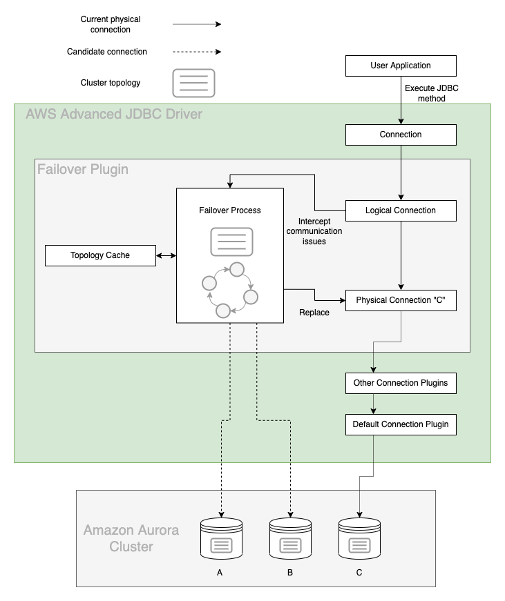

# Failover Plugin
In an Amazon Aurora database (DB) cluster, failover is a mechanism by which Aurora automatically repairs the DB cluster status when a primary DB instance becomes unavailable. It achieves this goal by electing an Aurora Replica to become the new primary DB instance, so that the DB cluster can provide maximum availability to a primary read-write DB instance. The AWS Advanced JDBC Driver uses the Failover Plugin to coordinate with this behavior in order to provide minimal downtime in the event of a DB instance failure.

## The AWS Advanced JDBC Driver Failover Process

<div style="text-align:center"></div>

The figure above provides a simplified overview of how the AWS Advanced JDBC Driver handles an Aurora failover encounter. Starting at the top of the diagram, an application with the AWS Advanced JDBC Driver on its class path uses the JDBC Driver to get a logical connection to an Aurora database.

In this example, the application requests a connection using the Aurora DB cluster endpoint and is returned with a logical connection that is physically connected to the primary DB instance in the DB cluster, DB instance C. By design, details about which specific DB instance the physical connection is connected to have been abstracted away.

Over the course of the application's lifetime, it executes various statements against the logical connection. If DB instance C is stable and active, these statements succeed and the application continues as normal. If DB instance C experiences a failure, Aurora will initiate failover to promote a new primary DB instance. At the same time, the JDBC Driver will intercept the related communication exception and kick off its own internal failover process.

If the primary DB instance has failed, the JDBC Driver attempts to use its internal topology cache to temporarily connect to an active Aurora Replica. This Aurora Replica will be periodically queried for the DB cluster topology until the new primary DB instance is identified (DB instance A or B in this case). If the driver is unable to connect to an active Aurora Replica or the cluster is still being reconfigured, the driver will retry the connection until it is successful.

At this point, the JDBC Driver will connect to the new primary DB instance and return control to the application by raising a FailoverSuccessSQLException with SQLState 08S02 so you can reconfigure the session state as needed. Although the DNS endpoint for the DB cluster might not yet resolve the new primary DB instance, the JDBC Driver has already discovered this new DB instance during its failover process, and will be directly connected to it when the application continues executing statements. In this way the JDBC Driver provides a faster way to reconnect to a newly promoted DB instance, thus increasing the availability of the DB cluster.

## Using the Failover Plugin
The failover plugin will be enabled by default if the [`wrapperPlugins`](../UsingTheJdbcDriver.md#connection-plugin-manager-parameters) value is not specified. The failover plugin can also be explicitly included by adding the plugin code `failover` to the [`wrapperPlugins`](../UsingTheJdbcDriver.md#aws-advanced-jdbc-driver-parameters) value, or by adding it to the current [driver profile](../UsingTheJdbcDriver.md#connection-plugin-manager-parameters). After you load the plugin, the failover feature will be enabled by default and the enableClusterAwareFailover parameter will be set to true. <br> <br> Please refer to the [failover configuration guide](../FailoverConfigurationGuide.md) for tips to keep in mind when using the failover plugin.

### Failover Parameters
In addition to the parameters that you can configure for the underlying driver, you can pass the following parameters to the AWS JDBC Driver through the connection URL to specify additional failover behavior.

| Parameter                              |  Value  |                                     Required                                     | Description                                                                                                                                                                                                                                                                                                                                                                                                                                                                                                                                                                                                                                                                                                                                                                                                                                                                                                                                                                                                          | Default Value                                                                                                                                                                                       |
|----------------------------------------|:-------:|:--------------------------------------------------------------------------------:|:---------------------------------------------------------------------------------------------------------------------------------------------------------------------------------------------------------------------------------------------------------------------------------------------------------------------------------------------------------------------------------------------------------------------------------------------------------------------------------------------------------------------------------------------------------------------------------------------------------------------------------------------------------------------------------------------------------------------------------------------------------------------------------------------------------------------------------------------------------------------------------------------------------------------------------------------------------------------------------------------------------------------|-----------------------------------------------------------------------------------------------------------------------------------------------------------------------------------------------------|
| `failoverMode`                         | String  |                                        No                                        | Defines a mode for failover process. Failover process may prioritize nodes with different roles and connect to them. Possible values: <br><br>- `strict-writer` - Failover process follows writer node and connects to a new writer when it changes.<br>- `reader-or-writer` - During failover, the driver tries to connect to any available/accessible reader node. If no reader is available, the driver will connect to a writer node. This logic mimics the logic of the Aurora read-only cluster endpoint.<br>- `strict-reader` - During failover, the driver tries to connect to any available reader node. If no reader is available, the driver raises an error. Reader failover to a writer node will only be allowed for single-node clusters. This logic mimics the logic of the Aurora read-only cluster endpoint.<br><br>If this parameter is omitted, default value depends on connection url. For Aurora read-only cluster endpoint, it's set to `reader-or-writer`. Otherwise, it's `strict-writer`. | Default value depends on connection url. For Aurora read-only cluster endpoint, it's set to `reader-or-writer`. Otherwise, it's `strict-writer`.                                                    |
| `clusterInstanceHostPattern`           | String  | If connecting using an IP address or custom domain URL: Yes<br><br>Otherwise: No | This parameter is not required unless connecting to an AWS RDS cluster via an IP address or custom domain URL. In those cases, this parameter specifies the cluster instance DNS pattern that will be used to build a complete instance endpoint. A "?" character in this pattern should be used as a placeholder for the DB instance identifiers of the instances in the cluster. See [here](#host-pattern) for more information. <br/><br/>Example: `?.my-domain.com`, `any-subdomain.?.my-domain.com:9999`<br/><br/>Use case Example: If your cluster instance endpoints follow this pattern:`instanceIdentifier1.customHost`, `instanceIdentifier2.customHost`, etc. and you want your initial connection to be to `customHost:1234`, then your connection string should look like this: `jdbc:aws-wrapper:mysql://customHost:1234/test?clusterInstanceHostPattern=?.customHost`                                                                                                                                 | If the provided connection string is not an IP address or custom domain, the JDBC Driver will automatically acquire the cluster instance host pattern from the customer-provided connection string. |
| `enableClusterAwareFailover`           | Boolean |                                        No                                        | Set to `true` to enable the fast failover behavior offered by the AWS Advanced JDBC Driver. Set to `false` for simple JDBC connections that do not require fast failover functionality.                                                                                                                                                                                                                                                                                                                                                                                                                                                                                                                                                                                                                                                                                                                                                                                                                              | `true`                                                                                                                                                                                              |
| `failoverClusterTopologyRefreshRateMs` | Integer |                                        No                                        | Cluster topology refresh rate in milliseconds during a writer failover process. During the writer failover process, cluster topology may be refreshed at a faster pace than normal to speed up discovery of the newly promoted writer.                                                                                                                                                                                                                                                                                                                                                                                                                                                                                                                                                                                                                                                                                                                                                                               | `2000`                                                                                                                                                                                              |
| `failoverReaderConnectTimeoutMs`       | Integer |                                        No                                        | Maximum allowed time in milliseconds to attempt to connect to a reader instance during a reader failover process.                                                                                                                                                                                                                                                                                                                                                                                                                                                                                                                                                                                                                                                                                                                                                                                                                                                                                                    | `30000`                                                                                                                                                                                             |
| `failoverTimeoutMs`                    | Integer |                                        No                                        | Maximum allowed time in milliseconds to attempt reconnecting to a new writer or reader instance after a cluster failover is initiated.                                                                                                                                                                                                                                                                                                                                                                                                                                                                                                                                                                                                                                                                                                                                                                                                                                                                               | `300000`                                                                                                                                                                                            |
| `failoverWriterReconnectIntervalMs`    | Integer |                                        No                                        | Interval of time in milliseconds to wait between attempts to reconnect to a failed writer during a writer failover process.                                                                                                                                                                                                                                                                                                                                                                                                                                                                                                                                                                                                                                                                                                                                                                                                                                                                                          | `2000`                                                                                                                                                                                              |
| `enableConnectFailover`                | Boolean |                                        No                                        | Enables/disables cluster-aware failover if the initial connection to the database fails due to a network exception. Note that this may result in a connection to a different instance in the cluster than was specified by the URL.                                                                                                                                                                                                                                                                                                                                                                                                                                                                                                                                                                                                                                                                                                                                                                                  | `false`                                                                                                                                                                                             |
| `skipFailoverOnInterruptedThread`      | Boolean |                                        No                                        | Enable to skip failover if the current thread is interrupted. This may leave the Connection in an invalid state so the Connection should be disposed.                                                                                                                                                                                                                                                                                                                                                                                                                                                                                                                                                                                                                                                                                                                                                                                                                                                                | `false`                                                                                                                                                                                             |
| ~~`keepSessionStateOnFailover`~~       | Boolean |                                        No                                        | This parameter is no longer available. If specified, it will be ignored by the driver. See [Session State](../SessionState.md) for more details.                                                                                                                                                                                                                                                                                                                                                                                                                                                                                                                                                                                                                                                                                                                                                                                                                                                                     | `false`                                                                                                                                                                                             |
| ~~`enableFailoverStrictReader`~~       | Boolean |                                        No                                        | This parameter is no longer available and, if specified, it will be ignored by the driver. See `failoverMode` (`reader-or-writer` or `strict-reader`) for more details.                                                                                                                                                                                                                                                                                                                                                                                                                                                                                                                                                                                                                                                                                                                                                                                                                                              |                                                                                                                                                                                                     |

## Host Pattern
When connecting to Aurora clusters, the [`clusterInstanceHostPattern`](#failover-parameters) parameter is required if the connection string does not provide enough information about the database cluster domain name. If the Aurora cluster endpoint is used directly, the AWS JDBC Driver will recognize the standard Aurora domain name and can re-build a proper Aurora instance name when needed. In cases where the connection string uses an IP address, a custom domain name, or localhost, the driver won't know how to build a proper domain name for a database instance endpoint. For example, if a custom domain was being used and the cluster instance endpoints followed a pattern of `instanceIdentifier1.customHost`, `instanceIdentifier2.customHost`, etc., the driver would need to know how to construct the instance endpoints using the specified custom domain. Since there isn't enough information from the custom domain alone to create the instance endpoints, you should set the `clusterInstanceHostPattern` to `?.customHost`, making the connection string `jdbc:aws-wrapper:postgresql://customHost:1234/test?clusterInstanceHostPattern=?.customHost`. Refer to [this diagram](../../images/failover_behavior.png) about AWS JDBC Driver behavior during failover for different connection URLs and more details and examples.

## Failover Exception Codes

| Exceptions                                 | Is the connection valid? | Can the connection be reused? | Has the session state changed? | Does the session need to be reconfigured? | Does the last statement need to be re-executed? | Does the transaction need to be restarted? |
|--------------------------------------------|--------------------------|-------------------------------|--------------------------------|-------------------------------------------|-------------------------------------------------|--------------------------------------------|
| 08001 - Unable to Establish SQL Connection | No                       | No                            | N/A                            | N/A                                       | Yes                                             | Yes                                        |
| 08S02 - Communication Link                 | Yes                      | Yes                           | Yes                            | Yes                                       | Yes                                             | N/A                                        |
| 08007 - Transaction Resolution Unknown     | Yes                      | Yes                           | Yes                            | Yes                                       | Yes                                             | Yes                                        |

### 08001 - Unable to Establish SQL Connection
When the AWS JDBC Driver throws a FailoverFailedSQLException, the original connection has failed, and the AWS JDBC Driver tried to failover to a new instance, but was unable to. There are various reasons this may happen: no nodes were available, a network failure occurred, and so on. In this scenario, please wait until the server is up or other problems are solved. (Exception will be thrown.)

### 08S02 - Communication Link
When the AWS JDBC Driver throws a FailoverSuccessSQLException, the original connection has failed while outside a transaction, and the AWS JDBC Driver successfully failed over to another available instance in the cluster. However, any session state configuration of the initial connection is now lost. In this scenario, you should:

- Reuse and reconfigure the original connection (e.g., reconfigure session state to be the same as the original connection).

- Repeat that query that was executed when the connection failed, and continue work as desired.

### 08007 - Transaction Resolution Unknown
When the AWS JDBC Driver throws a TransactionStateUnknownSQLException, the original connection has failed within a transaction. In this scenario, the JDBC wrapper first attempts to rollback the transaction and then fails over to another available instance in the cluster. Note that the rollback might be unsuccessful as the initial connection may be broken at the time that the JDBC wrapper recognizes the problem. Note also that any session state configuration of the initial connection is now lost. In this scenario, you should:

- Reuse and reconfigure the original connection (e.g: reconfigure session state to be the same as the original connection).

- Restart the transaction and repeat all queries which were executed during the transaction before the connection failed.

- Repeat that query which was executed when the connection failed and continue work as desired.

#### Sample Code
[PostgreSQL Failover Sample Code](./../../../examples/AWSDriverExample/src/main/java/software/amazon/PgFailoverSample.java)

>### :warning: Warnings About Proper Usage of the AWS Advanced JDBC Driver
>1. A common practice when using JDBC drivers is to wrap invocations against a Connection object in a try-catch block, and dispose of the Connection object if an Exception is hit. If this practice is left unaltered, the application will lose the fast-failover functionality offered by the JDBC Driver. When failover occurs, the JDBC Driver internally establishes a ready-to-use connection inside the original Connection object before throwing an exception to the user. If this Connection object is disposed of, the newly established connection will be thrown away. The correct practice is to check the SQL error code of the exception and reuse the Connection object if the error code indicates successful failover. The [PostgreSQL Failover Sample Code](./../../../examples/AWSDriverExample/src/main/java/software/amazon/PgFailoverSample.java) demonstrates this practice. See the section about [Failover Exception Codes](#failover-exception-codes) for more details.
<br><br>
>2. We highly recommended that you use the cluster and read-only cluster endpoints instead of the direct instance endpoints of your Aurora cluster, unless you are confident in your application's use of instance endpoints. Although the JDBC Driver will correctly failover to the new writer instance when using instance endpoints, use of these endpoints is discouraged because individual instances can spontaneously change reader/writer status when failover occurs. The JDBC Driver will always connect directly to the instance specified if an instance endpoint is provided, so a write-safe connection cannot be assumed if the application uses instance endpoints.

## Connection Pooling
The AWS Advanced JDBC Driver is compatible with [connection pooling](../DataSource.md#Using-the-AwsWrapperDataSource-with-Connection-Pooling-Frameworks), but some connection pooling libraries may contain additional behaviour when dealing with SQL exceptions. This means the exceptions created by the AWS JDBC Driver may not be recognized, and depending on the connection pool, connections may be closed prematurely due to the unrecognized SQL exceptions. Users are recommended to investigate the connection pooling library of their choice, and to implement any required additional code to allow the connection pool to accept the exceptions raised by the AWS JDBC Driver.

### HikariCP
The failover plugin throws failover-related exceptions that need to be handled explicitly by HikariCP,
otherwise connections will be closed immediately after failover.
When using HikariCP with the failover plugin, you need to provide a custom exception override class.
The AWS JDBC Driver provides a custom exception override class for HikariCP; to use it,
configure the HikariDataSource as follows:

```java
HikariDataSource ds = new HikariDataSource();
ds.setExceptionOverrideClassName("software.amazon.jdbc.util.HikariCPSQLException");
```

#### Sample Code
```java
import com.zaxxer.hikari.SQLExceptionOverride;
import java.sql.SQLException;
import software.amazon.jdbc.util.SqlState;

public class HikariCPSQLException implements SQLExceptionOverride {
    public Override adjudicate(final SQLException sqlException) {
        String sqlState = sqlException.getSQLState();
        if (sqlState.equalsIgnoreCase(SqlState.COMMUNICATION_LINK_CHANGED.getState()) ||
            sqlState.equalsIgnoreCase(SqlState.CONNECTION_FAILURE_DURING_TRANSACTION.getState())) {
            return Override.DO_NOT_EVICT;
        } else {
            return Override.CONTINUE_EVICT;
        }
    }
}
```

### Blue/Green Deployments
Although the AWS Advanced JDBC Wrapper is not compatible with [AWS Blue/Green Deployments](https://docs.aws.amazon.com/whitepapers/latest/overview-deployment-options/bluegreen-deployments.html) and does not officially support them, the combination of the AWS Advanced JDBC Wrapper and the Failover Plugin has been validated for use with clusters that employ Blue/Green Deployments. While general basic connectivity to both Blue and Green clusters is always in place, some failover cases are not fully supported.

The current limitations are:
- After a Blue/Green switchover, the wrapper may not be able to properly detect the new topology and handle failover, as there are discrepancies between the metadata and the available endpoints.
- The specific version requirements for Aurora MySQL versus Aurora PostgreSQL may vary, as the internal systems used by the wrapper can differ[^1].

The development team is aware of these limitations and is working to improve the wrapper's awareness and handling of Blue/Green switchovers. In the meantime, users can consider utilizing the `enableGreenNodeReplacement` configuration parameter, which allows the driver to override incorrect topology metadata and try to connect to available new Blue endpoints.

[^1]: Aurora MySQL requires v3.07 or later.
