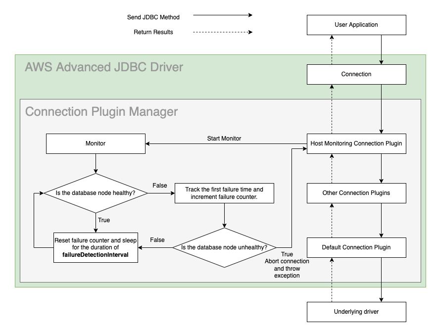

# Host Monitoring Plugin

## Enhanced Failure Monitoring
The figure that follows shows a simplified Enhanced Failure Monitoring (EFM) workflow. Enhanced Failure Monitoring is a feature available from the Host Monitoring Connection Plugin. The Host Monitoring Connection Plugin periodically checks the connected database node's health or availability. If a database node is determined to be unhealthy, the connection will be aborted. The Host Monitoring Connection Plugin uses the [Enhanced Failure Monitoring Parameters](#enhanced-failure-monitoring-parameters) and a database node's responsiveness to determine whether a node is healthy.

<div style="text-align:center"></div>

### The Benefits of Enhanced Failure Monitoring
Enhanced Failure Monitoring helps user applications detect failures earlier. When a user application executes a query, EFM may detect that the connected database node is unavailable. When this happens, the query is cancelled and the connection will be aborted. This allows queries to fail fast instead of waiting indefinitely or failing due to a timeout.

One use case is to pair EFM with the [Failover Connection Plugin](./UsingTheFailoverPlugin.md). When EFM discovers a database node failure, the connection will be aborted. Without the Failover Connection Plugin, the connection would be terminated up to the user application level. With the Failover Connection Plugin, the JDBC wrapper can attempt to failover to a different, healthy database node where the query can be executed.

Not all applications will have a need for Enhanced Failure Monitoring. If an application's query times are predictable and short, and the application does not execute any long-running SQL queries, Enhanced Failure Monitoring may be replaced with one of the following alternatives that consumes fewer resources and is simpler to configure. 

The [alternatives](#enhanced-failure-monitoring-alternatives) are: 
1. setting a [simple network timeout](#simple-network-timeout), or 
2. using [TCP Keepalive](#tcp-keepalive).

Although these alternatives are available, EFM is more configurable than simple network timeouts, and easier to configure than TCP Keepalive. Users should keep these advantages and disadvantages in mind when deciding whether Enhanced Failure Monitoring is suitable for their application.

### Enhanced Failure Monitoring Alternatives

#### Simple Network Timeout
This option is useful when a user application executes quick statements that run for predictable lengths of time. In this case, the network timeout should be set to a value such as the 95th to 99th percentile. One way to do this is with the `setNetworkTimeout` method.

#### TCP Keepalive
This option is useful because it is built into the TCP protocol. How you enable it depends on the underlying driver provided to the AWS JDBC Driver. For example, to enable TCP Keepalive with an underlying PostgreSQL driver, you will need to set the property `tcpKeepAlive` to `true`. TCP Keepalive settings, which are similar to some Enhanced Failure Monitoring parameters, are all configurable. However, this is specific to operating systems, so you should verify what your system needs before configuring TCP Keepalive on your system. See [this page](https://docs.aws.amazon.com/AmazonRDS/latest/AuroraUserGuide/AuroraPostgreSQL.BestPractices.FastFailover.html) for more information on how to set TCP Keepalive parameters.

### Enabling the Host Monitoring Connection Plugin
Enhanced Failure Monitoring will be enabled by default enabled if the [`wrapperPlugins`](../UsingTheJdbcDriver.md#connection-plugin-manager-parameters) value is not specified. The Host Monitoring Connection Plugin can also be explicitly included by adding the plugin code `efm` to the [`wrapperPlugins`](../UsingTheJdbcDriver.md#aws-advanced-jdbc-driver-parameters) value, or by adding it to the current [driver profile](../UsingTheJdbcDriver.md#aws-advanced-jdbc-driver-parameters). Enhanced Failure Monitoring is enabled by default when the Host Monitoring Connection Plugin is loaded, but it can be disabled with the parameter `failureDetectionEnabled` set to `false`.

> :warning: **Note:** When loading the Host Monitoring Connection Plugin, the order plugins are loaded in matters. We recommend that you load the Host Monitoring Connection Plugin at the end (or as close to the end) as possible. When used in conjunction with the Failover Connection Plugin, the Host Monitoring Connection Plugin must be loaded after the Failover Connection Plugin. For example, when loading plugins with the `wrapperPlugins` parameter, the parameter value should be `failover,...,efm`.
> 
### Enhanced Failure Monitoring Parameters
<div style="text-align:center"></div>

The parameters `failureDetectionTime`, `failureDetectionInterval`, and `failureDetectionCount` are similar to TCP Keepalive parameters. Each connection has its own set of parameters. The `failureDetectionTime` is how long the monitor waits after a SQL query is started to send a probe to a database node. The `failureDetectionInterval` is how often the monitor sends a probe to a database node. The `failureDetectionCount` is how many times a monitor probe can go unacknowledged before the database node is deemed unhealthy. 

To determine the health of a database node: 
1. The monitor will first wait for a time equivalent to the `failureDetectionTime`. 
2. Then, every `failureDetectionInterval`, the monitor will send a probe to the database node. 
3. If the probe is not acknowledged by the database node, a counter is incremented. 
4. If the counter reaches the `failureDetectionCount`, the database node will be deemed unhealthy and the connection will be aborted.

If a more aggressive approach to failure checking is necessary, all of these parameters can be reduced to reflect that. However, increased failure checking may also lead to an increase in false positives. For example, if the `failureDetectionInterval` was shortened, the plugin may complete several connection checks that all fail. The database node would then be considered unhealthy, but it may have been about to recover and the connection checks were completed before that could happen.

| Parameter                  |  Value  | Required | Description                                                                                                  | Default Value |
|----------------------------|:-------:|:--------:|:-------------------------------------------------------------------------------------------------------------|---------------|
| `failureDetectionCount`    | Integer |    No    | Number of failed connection checks before considering database node as unhealthy.                            | `3`           |
| `failureDetectionEnabled`  | Boolean |    No    | Set to `true` to enable Enhanced Failure Monitoring. Set to `false` to disable it.                           | `true`        |
| `failureDetectionInterval` | Integer |    No    | Interval in milliseconds between probes to database node.                                                    | `5000`        |
| `failureDetectionTime`     | Integer |    No    | Interval in milliseconds between sending a SQL query to the server and the first probe to the database node. | `30000`       |
| `monitorDisposalTime`      | Integer |    No    | Interval in milliseconds for a monitor to be considered inactive and to be disposed.                         | `60000`       |

The Host Monitoring Connection Plugin may create new monitoring connections to check the database node's availability. You can configure these connection with driver-specific configurations by adding the `monitoring-` prefix to the configuration parameters, like the following example:

```java
final Properties properties = new Properties();
// Configure the timeout values for all, non-monitoring connections.
properties.setProperty("connectTimeout", "30");
properties.setProperty("socketTimeout", "30");
// Configure different timeout values for the monitoring connections.
properties.setProperty("monitoring-connectTimeout", "10");
properties.setProperty("monitoring-socketTimeout", "10");
```

> :heavy_exclamation_mark: **Always ensure you provide a non-zero socket timeout value or a connect timeout value to the Host Monitoring Connection Plugin**
>
> The Host Monitoring Connection Plugin does not have default timeout values such as `connectTimeout` or `socketTimeout` since these values are driver specific. Most JDBC drivers use 0 as the default timeout value. If you **do not** override the default timeout value, the Host Monitoring Connection Plugin may wait forever to establish a monitoring connection in the event where the database node is unavailable.

>### :warning: Warnings About Usage of the AWS Advanced JDBC Driver with RDS Proxy
> We recommend you either disable the Host Monitoring Connection Plugin or avoid using RDS Proxy endpoints when the Host Monitoring Connection Plugin is active.
>
> Although using RDS Proxy endpoints with the AWS Advanced JDBC Driver with Enhanced Failure Monitoring doesn't cause any critical issues, we don't recommend this approach. The main reason is that RDS Proxy transparently re-routes requests to a single database instance. RDS Proxy decides which database instance is used based on many criteria (on a per-request basis). Switching between different instances makes the Host Monitoring Connection Plugin useless in terms of instance health monitoring because the plugin will be unable to identify which instance it's connected to, and which one it's monitoring. This could result in false positive failure detections. At the same time, the plugin will still proactively monitor network connectivity to RDS Proxy endpoints and report outages back to a user application if they occur.

# Host Monitoring Plugin v2

Host Monitoring Plugin v2, also known as `efm2`, is an alternative implementation of enhanced failure monitoring and it is functionally equal to the Host Monitoring Plugin described above. Both plugins share the same set of [configuration parameters](#enhanced-failure-monitoring-parameters). The `efm2` plugin is designed to be a drop-in replacement for the `efm` plugin.
The `efm2` plugin can be used in any scenario where the `efm` plugin is mentioned. This plugin is enabled by default since [version 2.3.3](https://github.com/awslabs/aws-advanced-jdbc-wrapper/releases/tag/2.3.3) of the driver. The original EFM plugin can still be used by specifying `efm` in the `wrapperPlugins` parameter.

> [!NOTE] Since these two plugins are separate plugins, users may decide to use them together with a single connection. While this should not  have any negative side effects, it is not recommended. It is recommended to use either the `efm` plugin, or the `efm2` plugin where it's needed.
 

The `efm2` plugin is designed to address [some of the issues](https://github.com/awslabs/aws-advanced-jdbc-wrapper/issues/675) that have been reported by multiple users. The following changes have been made:
- Used weak pointers to ease garbage collection
- Split monitoring logic into two separate threads to increase overall monitoring stability
- Reviewed locks for monitoring context
- Reviewed and redesigned stopping of idle monitoring threads
- Reviewed and simplified monitoring logic

