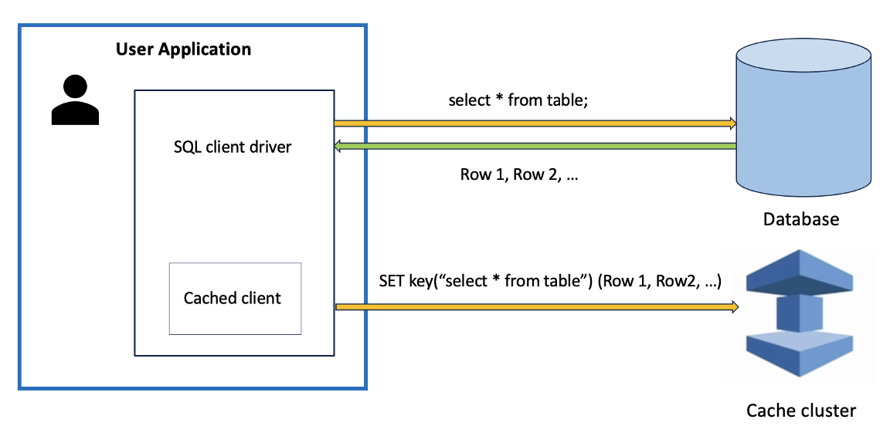
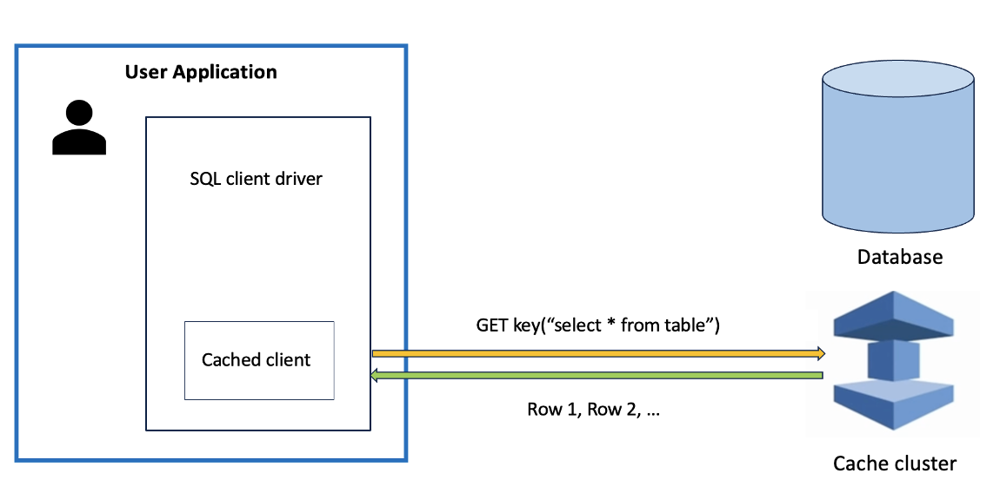
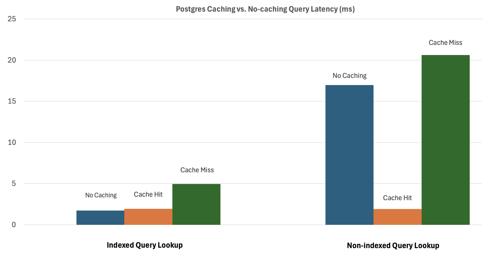

# Remote Query Cache Plugin

The remote query cache plugin adds a query caching layer that stores cacheable read-only query results in a remote Valkey cache instead of local JVM memory. Error responses from the database is not cached. Applications can opt‑in per query using a SQL query hint that specifies a time‑to‑live (TTL).

When a client application sends a query to the database, the caching logic inside the client driver evaluates the query hint prefixed in front of the query. If the query hint indicates it is cacheable, the client driver acquires a cache connection and does a cache lookup. If no cached result is found or the previous cached result has expired, the driver simply sends the query to the database, which executes the query and returns the query result set. The driver first reply back to the user with the DB response, and asynchronously writes the result to the cache with the defined TTL.



Once a particular query result is cached, subsequent identical queries are served directly from the cache while the TTL is valid. The cache server is assumed to scale independently and handles data eviction, removing client‑side memory pressure constraints.




## Plugin Availability
The plugin is available since version 3.2.2.

## Using the remote query cache plugin

The remote query cache plugin is not loaded by default. To load the plugin, include it in the `wrapperPlugins` connection parameter before creating the connection and running queries.

```
final Properties props = new Properties();
props.setProperty(PropertyDefinition.PLUGINS.name, "dataRemoteCache");
props.setProperty("cacheEndpointAddrRw", "mycache.amazonaws.com:6379");

// Create a connection and run a query
Connection conn = DriverManager.getConnection("jdbc:aws-wrapper:postgresql://mydb.amazonaws.com:5432/postgres", props);
Statement stmt = conn.createStatement();
ResultSet rs = stmt.executeQuery("/* CACHE_PARAM(ttl=300s) */ select * from mytable where id = 1");
...
```

## Configuration Parameters

| Parameter                          |  Value  | Required | Description                                                                                               | Default Value |
|------------------------------------|:-------:|:--------:|:----------------------------------------------------------------------------------------------------------|---------------|
| `cacheEndpointAddrRw`              | String  |   Yes    | The cache read-write server endpoint address.                                                             | null          |
| `cacheEndpointAddrRo`              | String  |    No    | The cache read-only server endpoint address.                                                              | null          | 
| `cacheUseSSL`                      | Boolean |    No    | Whether to use SSL for cache connection.                                                                  | "true"        |
| `cacheTlsCaCertPath`               | String  |    No    | File path to the CA certificate (PEM) file for verifying the cache server's TLS certificate.              | null          | 
| `cacheUsername`                    | String  |    No    | Username for Valkey cache regular authentication.                                                         | null          |
| `cachePassword`                    | String  |    No    | Password for Valkey cache regular authentication.                                                         | null          | 
| `cacheIamRegion`                   | String  |    No    | AWS region for ElastiCache IAM authentication.                                                            | null          |
| `cacheMaxQuerySize`                | Integer |    No    | The max length of the query for remote caching.                                                           | 16384         | 
| `cacheConnectionTimeout`           | Integer |    No    | Cache connection request timeout duration in milliseconds.                                                | 2000          |
| `cacheConnectionPoolSize`          | Integer |    No    | Cache connection pool size.                                                                               | 20            | 
| `cacheKeyPrefix`                   | String  |    No    | Optional prefix for cache keys (max 10 characters). Enables keyspace isolation for different connections. | null          |
| `failWhenCacheDown`                | Boolean |    No    | Whether to throw SQLException on cache failures under Degraded mode.                                      | "false"       | 
| `cacheInFlightWriteSizeLimitBytes` | Integer |    No    | Maximum in-flight write size in bytes to the cache server before triggering degraded mode.                | 52428800      |
| `cacheHealthCheckInHealthyState`   | Boolean |    No    | Whether to run health checks (pings) in healthy state.                                                    | "false"       |


## Overall Design

- Designed for caching read‑only queries that produce a ResultSet, which is typically good for certain types of database application workloads when the data in the table does not change very often.
- User application can enable remote query caching functionality with minimal amount of application code changes. It needs to enable the remote query caching plugin and specify the cache server’s endpoint when creating the JDBC connection, and prefix the query string with a SQL query hint containing the TTL.
- All incoming queries that contain a caching query hint prefix will have their responses cached with the specified TTL. Further requests with the same query get their result served from the cache instead of the backend database.
- For safety/security of caching operations, SQL queries longer than a specified length threshold (defaulted to 16K) will not be eligible for caching.
- Cache writes are asynchronous to reduce query latency but may lead to a brief time window where the first request is served from the database while a background write occurs to write the query result into the cache server.
- The cache server is responsible for item evictions and scaling; the client does not enforce an in‑JVM size limit for cached data.

### Cacheability and query hints

The plugin uses SQL query hints to determine cacheability of the query and TTL. Query hint has format: `/* CACHE_PARAM(ttl=300s) */`, with:
- Case‑insensitive `CACHE_PARAM` with `TTL` parameter in seconds. TTL values <= 0 are treated as malformed and the query will not get cached. Large TTL values are allowed, but the plugin enforces a maximum TTL of 180 days to prevent indefinite caching.
- Flexible placement within the SQL statement
- Absence of such caching query hint makes the query un-cacheable.

### Invalidation of cached entries

This is primarily done via a configured TTL for each cached entry, with an upper bound of 180 days to avoid caching entries permanently. User should define the TTL based on how frequently the underlying query data changes. User can bypass reading responses from the cache for queries that require stronger consistency.

In the case when the configured TTL is too long and causes stale data to be returned from the cache, there are a couple of options to mitigate this issue:
- Specify a configurable cache key prefix to allow multi‑tenant separation within a shared cache cluster. The cache key prefix can help segregate the keyspace of one application use-case from another, so the user can scan for and delete only keys with that particular prefix from the valkey server to clear the cache for only 1 application use-case without affecting other application use-cases.
- Flushing all data from the Valkey server (via a `FLUSHALL` command) so that it can be re-hydrated from the database again with fresh values.

### Query result correctness

Query cache entry is indexed by a hashed caching key containing the following parts:
- Database username - different database users can have different permissions on various tables.
- Database catalog/schema name - same table name can exist in a different database catalog/schema which contains different data
- The SQL query string

All queries inside a multi-statement transaction are inherently atomically consistent. When a readonly query is executed inside a multi-statement transaction, we can’t serve the query result from the cache because of consistency guarantee such as read-after-write consistency for a transaction would be violated. As a result, we need to fetch the query result from the database, and do a best-effort update to the cache with the new result set we fetched from the database. That way the subsequent queries that are standalone can fetch the newly updated result from the cache.

### Cache connection pooling

The plugin uses a dedicated connection pool to Valkey server with configurable connection timeout and the pool size. In addition, it supports TLS and non TLS connections

### Cache Authentication

The plugin supports plain username/password authentication for generic Valkey deployments, and IAM authentication for AWS ElastiCache.

### Cache Health Monitoring and Failure Handling

The plugin includes a health monitoring subsystem to avoid cascading failures when the cache is unhealthy.

- CacheMonitor and states
  * Tracks cache health with states such as HEALTHY, SUSPECT, and DEGRADED.
  * Performs background health checks and tracks error types and memory pressure.
- When the cache is unhealthy, the plugin can:
  * Bypass cache reads and writes, effectively operating as if caching were disabled,
  * Fail fast on cache access while still letting database queries proceed.
  * Errors from cache initialization or operations are treated as cache misses so that the database path still functions.

## Telemetry / Operational Visibility

| Metric Name                                            | Description                                                                     |
|--------------------------------------------------------|:--------------------------------------------------------------------------------|
| `dataRemoteCache.cache.hit`                            | Total number of cache hits                                                      |
| `dataRemoteCache.cache.miss`                           | Total number of cache misses                                                    |
| `dataRemoteCache.cache.totalQueries`                   | Total number of total cache queries                                             |
| `dataRemoteCache.cache.malformedHints`                 | Total number of malformed query hints                                           |
| `dataRemoteCache.cache.bypass`                         | Total number of cache bypasses                                                  |
| `dataRemoteCache.cache.error`                          | Total number of errors encountered when processing cached queries               |
| `dataRemoteCache.cache.stateTransition`                | Total number of state transitions for a particular cache cluster endpoint       |
| `dataRemoteCache.cache.healthCheck.success`            | Total number of successful health checks to a particular cache cluster endpoint |
| `dataRemoteCache.cache.healthCheck.failure`            | Total number of failed health checks to a particular cache cluster endpoint     |
| `dataRemoteCache.cache.healthCheck.consecutiveSuccess` | Max number of consecutive health check successes across clusters                |
| `dataRemoteCache.cache.healthCheck.consecutiveFailure` | Max number of consecutive health check failures across clusters                 |


## Query Performance with Caching

When querying for a single record out of a database table running PG/MySQL with 400K records and 1.3KB of data per record. The client application runs on an EC2 instance in the same VPC as the Valkey cache server and the database server. The observations are:

- With an indexed lookup such as primary key lookup in a database table, the database operates like a key/value, leverages the buffered cache, and can operate on par with the speed of an in-memory key/value cache. The average latency with caching and without caching are both in low single-digit millisecond range without noticeable differences. As the number of concurrent client connection increases, the Valkey cache appears to scale better than PG/MySQL with significantly less overall CPU consumption.
- With more expensive queries such as non-indexed queries, the query execution time in database can be significantly worse compared to doing the query lookup in the cache server. In our experiment, performing a query based on a column without index can take up to ~100ms to execute in PG/MySQL while consuming significant amount of CPU. With caching we are able to achieve single digit millisecond latency with only 1-2% of engine CPU in Valkey, which is > 90% reduction in latency and > 10x improvement to query performance. (Note: there are other complex query scenarios when caching becomes useful such as multi-table join operations)
- A cache miss will lead to higher latency than querying the database directly due to the network RTT to do the lookup in the cache being added on top of a regular database query. Maximize cache hit rate and reduce the miss rate in order to benefit from caching.




## Using Hibernate framework with AWS Advanced JDBC wrapper caching

Hibernate is the most widely adopted Object-Relational Mapping (ORM) framework in the Java ecosystem. It simplifies database interactions by mapping Java objects to relational database tables. It handles the conversion of data between Java object-oriented code and the relational database, reducing the need for developers to write tedious SQL and JDBC boilerplate code. Hibernate is also a popular implementation of the Jakarta Persistence API (JPA).

There are 2 ways to enable the remote query caching plugin in the AWS JDBC driver and get the query hint embedded into the underlying SQL string that is sent to the database:

### Set a static query hint on the Entity class using @QueryHint annotation with @NamedQuery

See the following Hibernate code sample snippet (tested on Hibernate v5.6.15 and above)

```
import javax.persistence.*;

@Entity
@NamedQuery(
    name = "Plane.findAll",
    query = "SELECT p FROM Plane p",
    hints = @QueryHint(name = org.hibernate.jpa.QueryHints.HINT_COMMENT, value = "+CACHE_PARAM(ttl=250s)")
)
@Table(name = "Plane")
public class Plane {
  @Id
  @GeneratedValue(strategy = GenerationType.IDENTITY)
  private Long id;

  @Column(nullable = false, unique = true)
  private String name;

  public Plane() {}

  public Plane(String name) {
    this.name = name;
  }
}
```

Example Hibernate program:

```
import org.hibernate.*;
import org.hibernate.boot.registry.*;
import org.hibernate.cfg.Configuration;

public void main() {
  final Configuration configuration = new Configuration();
  configuration.addAnnotatedClass(Plane.class);
  // Regular configurations
  ...

  // Enable query caching plugin
  configuration.setProperty("hibernate.use_sql_comments", "true");
  configuration.setProperty("hibernate.connection.wrapperPlugins", "dataRemoteCache");
  configuration.setProperty("hibernate.connection.cacheEndpointAddrRw", "mycache.amazonaws.com:6379");

  // Run the query
  try (StandardServiceRegistry serviceRegistry = new StandardServiceRegistryBuilder()
      .applySettings(configuration.getProperties())
      .build()) {
    SessionFactory sessionFactory = configuration.buildSessionFactory(serviceRegistry);
    try (Session session = sessionFactory.openSession()) {
      // Run named query using annotation-based hint
      List<Plane> planes = session.createNamedQuery("Plane.findAll", Plane.class).getResultList();
      System.out.println("Planes from named query: " + planes.size());
    }
  }
}
```

### Setting a dynamic query hint at runtime using the Query.setHint() method.

See the following Hibernate code sample snippet (tested on Hibernate v5.6.15 and above)

```
import javax.persistence.*;

@Entity
@Table(name = "Users")
public class Users {
  @Id
  @GeneratedValue(strategy = GenerationType.IDENTITY)
  private int id;

  @Column(nullable = false)
  private String email;

  @Column(nullable = false)
  private String name;

  @Column(nullable = false, unique = true)
  private String phone;
}
```

Example Hibernate program:

```
import javax.persistence.criteria.*;
import org.hibernate.*;
import org.hibernate.boot.registry.*;
import org.hibernate.cfg.Configuration;
import org.hibernate.query.Query;

public void main() {
  final Configuration configuration = new Configuration();
  configuration.addAnnotatedClass(Users.class);
  // Regular configurations 
  ...
  // Caching enablement
  configuration.setProperty("hibernate.use_sql_comments", "true");
  configuration.setProperty("hibernate.connection.wrapperPlugins", "dataRemoteCache");
  configuration.setProperty("hibernate.connection.cacheEndpointAddrRw", "mycache.amazonaws.com:6379");

  // Issues the query
  try (StandardServiceRegistry serviceRegistry = new StandardServiceRegistryBuilder()
    .applySettings(configuration.getProperties())
    .build()) {
    SessionFactory sessionFactory = configuration.buildSessionFactory(serviceRegistry);
    try (Session session = sessionFactory.openSession()) {
      // Find User with ID 100
      CriteriaBuilder criteriaBuilder = session.getCriteriaBuilder();
      CriteriaQuery<Users> criteriaQuery = criteriaBuilder.createQuery(Users.class);
      Root<Users> root = criteriaQuery.from(Users.class);
      criteriaQuery.select(root).where(criteriaBuilder.equal(root.get("id"), 100));

      // Issue the query with caching query hint
      Query<Users> query = session.createQuery(criteriaQuery);
      query.setHint(org.hibernate.annotations.QueryHints.COMMENT, "CACHE_PARAM(ttl=100s)");
      Users user = query.uniqueResult();
    }
  }
}
```

This effectively generates the following underlying SQL with the caching related query hint prefixed in front which can then be handled by our caching plugin. i.e.

```
/* CACHE_PARAM(ttl=100s) */ select user0_.id as id1_2_, user0_.email as email2_2_,
    user0_.name as name3_2_, user0_.phone as phone4_2_ 
  from Users user0_ 
  where user0_.id=100
```

## Using Spring JDBC framework with AWS Advanced JDBC wrapper caching

Here is a minimal Spring JDBC example program that uses the remote query cache plugin.

```
import static software.amazon.jdbc.plugin.cache.CacheConnection.CACHE_RW_ENDPOINT_ADDR;

import java.util.Properties;
import javax.sql.DataSource;
import org.springframework.jdbc.core.JdbcTemplate;
import org.springframework.jdbc.datasource.DriverManagerDataSource;
import software.amazon.jdbc.PropertyDefinition;

public void main() {
    DriverManagerDataSource dataSource = new DriverManagerDataSource();
    dataSource.setDriverClassName("software.amazon.jdbc.Driver");
    dataSource.setUrl(ConnectionStringHelper.getWrapperUrl());
    dataSource.setUsername("username");
    dataSource.setPassword("password");


    Properties props = new Properties();
    // Regular configurations 
    ...
    // Caching enablement
    props.setProperty(PropertyDefinition.PLUGINS.name, "dataRemoteCache");
    props.setProperty(CACHE_RW_ENDPOINT_ADDR.name, "mycache.amazonaws.com:6379");

    dataSource.setConnectionProperties(props);
    
    JdbcTemplate jdbcTemplate = new JdbcTemplate(dataSource);

    Integer id = jdbcTemplate.queryForObject("/* CACHE_PARAM(ttl=100s) */ SELECT id from mytable where name = 'A'", Integer.class);
    assertEquals(10, id);
}
```

Alternatively, you can pass SQL hints with PreparedStatement in Spring JDBC, keep the hint in the static SQL string and continue to bind only dynamic values as parameters.

```
import static software.amazon.jdbc.plugin.cache.CacheConnection.CACHE_RW_ENDPOINT_ADDR;

import java.util.Properties;
import javax.sql.DataSource;
import org.springframework.jdbc.core.JdbcTemplate;
import org.springframework.jdbc.datasource.DriverManagerDataSource;
import software.amazon.jdbc.PropertyDefinition;

public void main(String status) {
    DriverManagerDataSource dataSource = new DriverManagerDataSource();
    dataSource.setDriverClassName("software.amazon.jdbc.Driver");
    dataSource.setUrl(ConnectionStringHelper.getWrapperUrl());
    dataSource.setUsername("username");
    dataSource.setPassword("password");

    Properties props = new Properties();
    // Regular configurations 
    ...
    // Caching enablement
    props.setProperty(PropertyDefinition.PLUGINS.name, "dataRemoteCache");
    props.setProperty(CACHE_RW_ENDPOINT_ADDR.name, "mycache.amazonaws.com:6379");
    dataSource.setConnectionProperties(props);
    JdbcTemplate jdbcTemplate = new JdbcTemplate(dataSource);

    String SQL_FIND = "/* CACHE_PARAM(ttl=60s) */ SELECT * FROM customers WHERE status = ?";
    jdbcTemplate.query(
        con -> {
          PreparedStatement ps = con.prepareStatement(SQL_FIND);
          ps.setString(1, status);   // user input as parameter
          return ps;
        },
        (rs, rowNum) -> new Customer(
            rs.getLong("id"),
            rs.getString("name"),
            rs.getString("status")
        )
    );
}
```

## Other Example Programs
[DatabaseConnectionWithCacheExample.java](../../../examples/AWSDriverExample/src/main/java/software/amazon/DatabaseConnectionWithCacheExample.java) demonstrates how to enable and configure remote query cache plugin with the AWS Advanced JDBC Wrapper.
